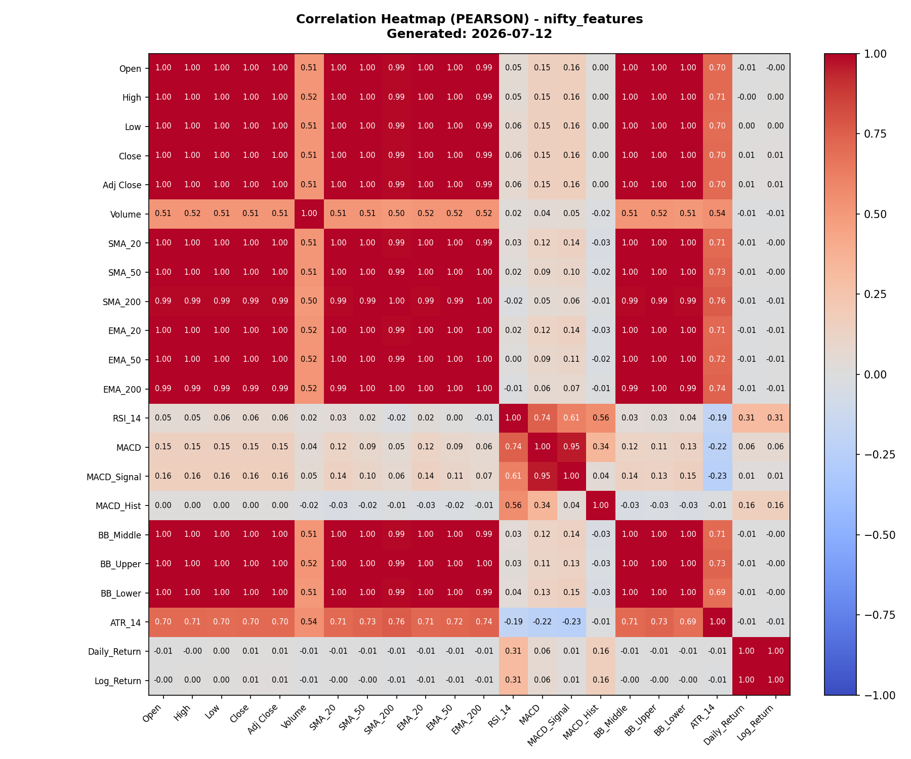
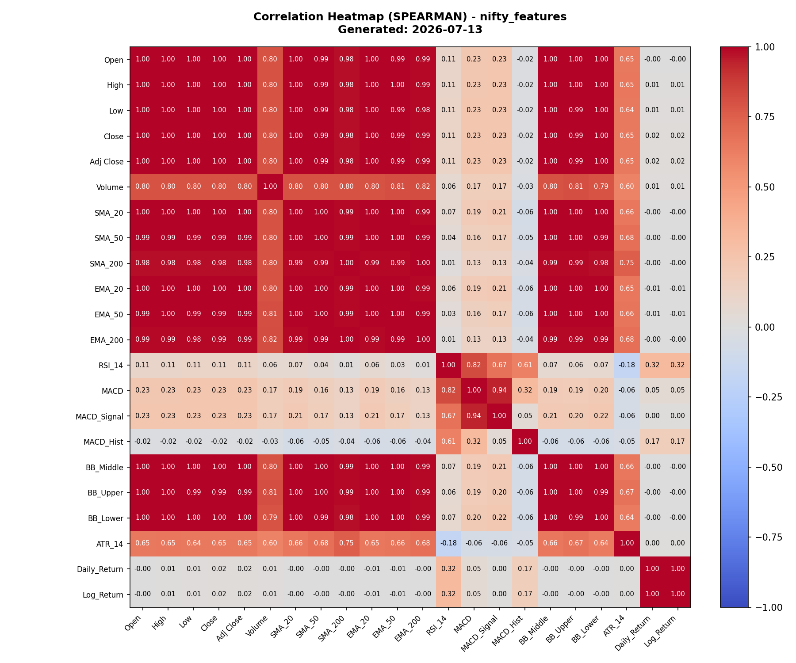

# QuantEngine: Feature Correlation Analysis Report
**Report Generated At**: 2026-07-13 00:00:04
**Number of Analyzed Features**: 22

## 1. Methodology Summary
This report evaluates pairwise linear (**Pearson**) and rank-based (**Spearman**) correlations between all technical indicators.
- **Pearson correlation** captures linear relationships. It assumes normal distributions.
- **Spearman correlation** evaluates monotonic relationships and is less sensitive to extreme outliers or nonlinear mappings. Disagreements between Pearson and Spearman reveal non-linear patterns.
Constant columns yield `NaN` values. Pairwise correlations skip missing data (warm-up periods) dynamically.

## 2. Highest Correlation Pairs (Top Ranked)
### Top 20 Pairs: PEARSON
| Rank | Feature A | Feature B | Coefficient | Abs Value |
| :--- | :--- | :--- | :--- | :--- |
| 1 | `Close` | `Adj Close` | 1.0000 | 1.0000 |
| 2 | `SMA_20` | `BB_Middle` | 1.0000 | 1.0000 |
| 3 | `Open` | `High` | 1.0000 | 1.0000 |
| 4 | `SMA_20` | `EMA_20` | 0.9999 | 0.9999 |
| 5 | `EMA_20` | `BB_Middle` | 0.9999 | 0.9999 |
| 6 | `High` | `Close` | 0.9999 | 0.9999 |
| 7 | `High` | `Adj Close` | 0.9999 | 0.9999 |
| 8 | `Low` | `Close` | 0.9999 | 0.9999 |
| 9 | `Low` | `Adj Close` | 0.9999 | 0.9999 |
| 10 | `Open` | `Low` | 0.9999 | 0.9999 |
| 11 | `High` | `Low` | 0.9999 | 0.9999 |
| 12 | `Open` | `Close` | 0.9999 | 0.9999 |
| 13 | `Open` | `Adj Close` | 0.9999 | 0.9999 |
| 14 | `SMA_50` | `EMA_50` | 0.9999 | 0.9999 |
| 15 | `Daily_Return` | `Log_Return` | 0.9996 | 0.9996 |
| 16 | `SMA_200` | `EMA_200` | 0.9995 | 0.9995 |
| 17 | `EMA_20` | `EMA_50` | 0.9995 | 0.9995 |
| 18 | `SMA_20` | `BB_Upper` | 0.9994 | 0.9994 |
| 19 | `BB_Middle` | `BB_Upper` | 0.9994 | 0.9994 |
| 20 | `EMA_20` | `BB_Upper` | 0.9994 | 0.9994 |

### Top 20 Pairs: SPEARMAN
| Rank | Feature A | Feature B | Coefficient | Abs Value |
| :--- | :--- | :--- | :--- | :--- |
| 1 | `Close` | `Adj Close` | 1.0000 | 1.0000 |
| 2 | `Daily_Return` | `Log_Return` | 1.0000 | 1.0000 |
| 3 | `SMA_20` | `BB_Middle` | 1.0000 | 1.0000 |
| 4 | `Open` | `High` | 0.9998 | 0.9998 |
| 5 | `High` | `Adj Close` | 0.9998 | 0.9998 |
| 6 | `High` | `Close` | 0.9998 | 0.9998 |
| 7 | `EMA_20` | `BB_Middle` | 0.9998 | 0.9998 |
| 8 | `SMA_20` | `EMA_20` | 0.9998 | 0.9998 |
| 9 | `Low` | `Adj Close` | 0.9998 | 0.9998 |
| 10 | `Low` | `Close` | 0.9998 | 0.9998 |
| 11 | `Open` | `Low` | 0.9997 | 0.9997 |
| 12 | `High` | `Low` | 0.9997 | 0.9997 |
| 13 | `Open` | `Adj Close` | 0.9996 | 0.9996 |
| 14 | `Open` | `Close` | 0.9996 | 0.9996 |
| 15 | `SMA_50` | `EMA_50` | 0.9995 | 0.9995 |
| 16 | `EMA_20` | `EMA_50` | 0.9986 | 0.9986 |
| 17 | `EMA_50` | `BB_Middle` | 0.9985 | 0.9985 |
| 18 | `SMA_20` | `EMA_50` | 0.9985 | 0.9985 |
| 19 | `SMA_20` | `BB_Upper` | 0.9985 | 0.9985 |
| 20 | `BB_Middle` | `BB_Upper` | 0.9985 | 0.9985 |

## 3. Redundancy & Domain Observations ($|r| \ge 0.9$)
The following feature pairs exhibit strong correlations (above threshold 0.9):
| Feature A | Feature B | Pearson $r$ | Context / Domain Caveat |
| :--- | :--- | :--- | :--- |
| `Close` | `Adj Close` | 1.0000 | Identical by construction; representing index close values without dividend distributions. |
| `SMA_20` | `BB_Middle` | 1.0000 | BB Middle Band is mathematically equivalent to SMA_20 by configuration design. |
| `Open` | `High` | 1.0000 | Structural intraday price markers representing snapshots of the same daily session. |
| `SMA_20` | `EMA_20` | 0.9999 | BB Middle Band is mathematically equivalent to SMA_20 by configuration design. |
| `EMA_20` | `BB_Middle` | 0.9999 | BB Middle Band is mathematically equivalent to SMA_20 by configuration design. |
| `High` | `Close` | 0.9999 | Structural intraday price markers representing snapshots of the same daily session. |
| `High` | `Adj Close` | 0.9999 | Structural intraday price markers representing snapshots of the same daily session. |
| `Low` | `Close` | 0.9999 | Structural intraday price markers representing snapshots of the same daily session. |
| `Low` | `Adj Close` | 0.9999 | Structural intraday price markers representing snapshots of the same daily session. |
| `Open` | `Low` | 0.9999 | Structural intraday price markers representing snapshots of the same daily session. |
| `High` | `Low` | 0.9999 | Structural intraday price markers representing snapshots of the same daily session. |
| `Open` | `Close` | 0.9999 | Structural intraday price markers representing snapshots of the same daily session. |
| `Open` | `Adj Close` | 0.9999 | Structural intraday price markers representing snapshots of the same daily session. |
| `SMA_50` | `EMA_50` | 0.9999 | Moving averages of the same window length (50) tracking the same smoothed price wave. |
| `Daily_Return` | `Log_Return` | 0.9996 | Daily return and log return are mathematically near-identical for typical daily percentage shifts. |
| `SMA_200` | `EMA_200` | 0.9995 | Moving averages of the same window length (200) tracking the same smoothed price wave. |
| `EMA_20` | `EMA_50` | 0.9995 | Standard correlation expected between lagging price indicators. |
| `SMA_20` | `BB_Upper` | 0.9994 | Standard correlation expected between lagging price indicators. |
| `BB_Middle` | `BB_Upper` | 0.9994 | Standard correlation expected between lagging price indicators. |
| `EMA_20` | `BB_Upper` | 0.9994 | Standard correlation expected between lagging price indicators. |
| `EMA_50` | `BB_Middle` | 0.9994 | Standard correlation expected between lagging price indicators. |
| `SMA_20` | `EMA_50` | 0.9994 | Standard correlation expected between lagging price indicators. |
| `BB_Middle` | `BB_Lower` | 0.9994 | Standard correlation expected between lagging price indicators. |
| `SMA_20` | `BB_Lower` | 0.9994 | Standard correlation expected between lagging price indicators. |
| `High` | `EMA_20` | 0.9994 | Standard correlation expected between lagging price indicators. |
| `EMA_20` | `BB_Lower` | 0.9993 | Standard correlation expected between lagging price indicators. |
| `Open` | `EMA_20` | 0.9993 | Standard correlation expected between lagging price indicators. |
| `EMA_50` | `BB_Upper` | 0.9992 | Standard correlation expected between lagging price indicators. |
| `Close` | `EMA_20` | 0.9992 | Standard correlation expected between lagging price indicators. |
| `Adj Close` | `EMA_20` | 0.9992 | Standard correlation expected between lagging price indicators. |
| `Low` | `EMA_20` | 0.9992 | Standard correlation expected between lagging price indicators. |
| `High` | `BB_Middle` | 0.9991 | Standard correlation expected between lagging price indicators. |
| `High` | `SMA_20` | 0.9991 | Standard correlation expected between lagging price indicators. |
| `SMA_50` | `EMA_20` | 0.9990 | Standard correlation expected between lagging price indicators. |
| `Open` | `SMA_20` | 0.9990 | Standard correlation expected between lagging price indicators. |
| `Open` | `BB_Middle` | 0.9990 | Standard correlation expected between lagging price indicators. |
| `SMA_50` | `BB_Middle` | 0.9990 | Standard correlation expected between lagging price indicators. |
| `SMA_20` | `SMA_50` | 0.9990 | Standard correlation expected between lagging price indicators. |
| `Close` | `SMA_20` | 0.9989 | Standard correlation expected between lagging price indicators. |
| `Adj Close` | `SMA_20` | 0.9989 | Standard correlation expected between lagging price indicators. |
| `Close` | `BB_Middle` | 0.9989 | Standard correlation expected between lagging price indicators. |
| `Adj Close` | `BB_Middle` | 0.9989 | Standard correlation expected between lagging price indicators. |
| `SMA_50` | `BB_Upper` | 0.9989 | Standard correlation expected between lagging price indicators. |
| `Low` | `SMA_20` | 0.9989 | Standard correlation expected between lagging price indicators. |
| `Low` | `BB_Middle` | 0.9989 | Standard correlation expected between lagging price indicators. |
| `Open` | `BB_Lower` | 0.9986 | Standard correlation expected between lagging price indicators. |
| `High` | `BB_Lower` | 0.9986 | Standard correlation expected between lagging price indicators. |
| `Low` | `BB_Lower` | 0.9985 | Standard correlation expected between lagging price indicators. |
| `Adj Close` | `BB_Lower` | 0.9985 | Standard correlation expected between lagging price indicators. |
| `Close` | `BB_Lower` | 0.9985 | Standard correlation expected between lagging price indicators. |
| `High` | `BB_Upper` | 0.9984 | Standard correlation expected between lagging price indicators. |
| `EMA_50` | `BB_Lower` | 0.9983 | Standard correlation expected between lagging price indicators. |
| `Open` | `BB_Upper` | 0.9982 | Standard correlation expected between lagging price indicators. |
| `High` | `EMA_50` | 0.9982 | Standard correlation expected between lagging price indicators. |
| `Close` | `BB_Upper` | 0.9982 | Standard correlation expected between lagging price indicators. |
| `Adj Close` | `BB_Upper` | 0.9982 | Standard correlation expected between lagging price indicators. |
| `Open` | `EMA_50` | 0.9980 | Standard correlation expected between lagging price indicators. |
| `Low` | `BB_Upper` | 0.9980 | Standard correlation expected between lagging price indicators. |
| `Adj Close` | `EMA_50` | 0.9980 | Standard correlation expected between lagging price indicators. |
| `Close` | `EMA_50` | 0.9980 | Standard correlation expected between lagging price indicators. |
| `Low` | `EMA_50` | 0.9978 | Standard correlation expected between lagging price indicators. |
| `SMA_50` | `BB_Lower` | 0.9978 | Standard correlation expected between lagging price indicators. |
| `BB_Upper` | `BB_Lower` | 0.9976 | Standard correlation expected between lagging price indicators. |
| `High` | `SMA_50` | 0.9974 | Standard correlation expected between lagging price indicators. |
| `Open` | `SMA_50` | 0.9973 | Standard correlation expected between lagging price indicators. |
| `Adj Close` | `SMA_50` | 0.9972 | Standard correlation expected between lagging price indicators. |
| `Close` | `SMA_50` | 0.9972 | Standard correlation expected between lagging price indicators. |
| `EMA_50` | `EMA_200` | 0.9972 | Standard correlation expected between lagging price indicators. |
| `Low` | `SMA_50` | 0.9971 | Standard correlation expected between lagging price indicators. |
| `SMA_50` | `EMA_200` | 0.9969 | Standard correlation expected between lagging price indicators. |
| `EMA_200` | `BB_Upper` | 0.9954 | Standard correlation expected between lagging price indicators. |
| `EMA_20` | `EMA_200` | 0.9951 | Standard correlation expected between lagging price indicators. |
| `SMA_20` | `EMA_200` | 0.9949 | Standard correlation expected between lagging price indicators. |
| `EMA_200` | `BB_Middle` | 0.9949 | Standard correlation expected between lagging price indicators. |
| `SMA_200` | `EMA_50` | 0.9948 | Standard correlation expected between lagging price indicators. |
| `SMA_50` | `SMA_200` | 0.9945 | Standard correlation expected between lagging price indicators. |
| `High` | `EMA_200` | 0.9934 | Standard correlation expected between lagging price indicators. |
| `Open` | `EMA_200` | 0.9932 | Standard correlation expected between lagging price indicators. |
| `EMA_200` | `BB_Lower` | 0.9931 | Standard correlation expected between lagging price indicators. |
| `Close` | `EMA_200` | 0.9931 | Standard correlation expected between lagging price indicators. |
| `Adj Close` | `EMA_200` | 0.9931 | Standard correlation expected between lagging price indicators. |
| `Low` | `EMA_200` | 0.9930 | Standard correlation expected between lagging price indicators. |
| `SMA_200` | `BB_Upper` | 0.9928 | Standard correlation expected between lagging price indicators. |
| `SMA_200` | `EMA_20` | 0.9922 | Standard correlation expected between lagging price indicators. |
| `SMA_20` | `SMA_200` | 0.9919 | Standard correlation expected between lagging price indicators. |
| `SMA_200` | `BB_Middle` | 0.9919 | Standard correlation expected between lagging price indicators. |
| `High` | `SMA_200` | 0.9904 | Standard correlation expected between lagging price indicators. |
| `Open` | `SMA_200` | 0.9901 | Standard correlation expected between lagging price indicators. |
| `Close` | `SMA_200` | 0.9901 | Standard correlation expected between lagging price indicators. |
| `Adj Close` | `SMA_200` | 0.9901 | Standard correlation expected between lagging price indicators. |
| `Low` | `SMA_200` | 0.9899 | Standard correlation expected between lagging price indicators. |
| `SMA_200` | `BB_Lower` | 0.9899 | Standard correlation expected between lagging price indicators. |
| `MACD` | `MACD_Signal` | 0.9540 | MACD Signal is computed as a smoothed exponential moving average of MACD. |

## 4. Redundant Feature Groupings
Below are groups of features clustered together via connected components where every connection has an absolute Pearson correlation $\ge 0.9$. Sparing one variable per group is advised during model feature selection:

**Group 1**: [`Adj Close`, `BB_Lower`, `BB_Middle`, `BB_Upper`, `Close`, `EMA_20`, `EMA_200`, `EMA_50`, `High`, `Low`, `Open`, `SMA_20`, `SMA_200`, `SMA_50`]
**Group 2**: [`MACD`, `MACD_Signal`]
**Group 3**: [`Daily_Return`, `Log_Return`]

## 5. Potential Data Leakage / Near-Duplicate Flags
> [!WARNING]
> **Potential lookahead/leakage risk detected (Pearson $|r| \ge 0.99$):**
> These features are nearly identical. Using both in regression or neural network models causes extreme multicollinearity or validation leakage. Review if they represent identical inputs:

> - `Close` ↔ `Adj Close` (Correlation: 1.000000)
> - `SMA_20` ↔ `BB_Middle` (Correlation: 1.000000)
> - `Open` ↔ `High` (Correlation: 0.999952)
> - `SMA_20` ↔ `EMA_20` (Correlation: 0.999945)
> - `EMA_20` ↔ `BB_Middle` (Correlation: 0.999945)
> - `High` ↔ `Close` (Correlation: 0.999944)
> - `High` ↔ `Adj Close` (Correlation: 0.999944)
> - `Low` ↔ `Close` (Correlation: 0.999944)
> - `Low` ↔ `Adj Close` (Correlation: 0.999944)
> - `Open` ↔ `Low` (Correlation: 0.999927)
> - `High` ↔ `Low` (Correlation: 0.999912)
> - `Open` ↔ `Close` (Correlation: 0.999880)
> - `Open` ↔ `Adj Close` (Correlation: 0.999880)
> - `SMA_50` ↔ `EMA_50` (Correlation: 0.999858)
> - `Daily_Return` ↔ `Log_Return` (Correlation: 0.999638)
> - `SMA_200` ↔ `EMA_200` (Correlation: 0.999466)
> - `EMA_20` ↔ `EMA_50` (Correlation: 0.999462)
> - `SMA_20` ↔ `BB_Upper` (Correlation: 0.999434)
> - `BB_Middle` ↔ `BB_Upper` (Correlation: 0.999434)
> - `EMA_20` ↔ `BB_Upper` (Correlation: 0.999401)
> - `EMA_50` ↔ `BB_Middle` (Correlation: 0.999395)
> - `SMA_20` ↔ `EMA_50` (Correlation: 0.999395)
> - `BB_Middle` ↔ `BB_Lower` (Correlation: 0.999384)
> - `SMA_20` ↔ `BB_Lower` (Correlation: 0.999384)
> - `High` ↔ `EMA_20` (Correlation: 0.999354)
> - `EMA_20` ↔ `BB_Lower` (Correlation: 0.999305)
> - `Open` ↔ `EMA_20` (Correlation: 0.999281)
> - `EMA_50` ↔ `BB_Upper` (Correlation: 0.999241)
> - `Close` ↔ `EMA_20` (Correlation: 0.999211)
> - `Adj Close` ↔ `EMA_20` (Correlation: 0.999211)
> - `Low` ↔ `EMA_20` (Correlation: 0.999151)
> - `High` ↔ `BB_Middle` (Correlation: 0.999081)
> - `High` ↔ `SMA_20` (Correlation: 0.999081)
> - `SMA_50` ↔ `EMA_20` (Correlation: 0.999025)
> - `Open` ↔ `SMA_20` (Correlation: 0.998998)
> - `Open` ↔ `BB_Middle` (Correlation: 0.998998)
> - `SMA_50` ↔ `BB_Middle` (Correlation: 0.998958)
> - `SMA_20` ↔ `SMA_50` (Correlation: 0.998958)
> - `Close` ↔ `SMA_20` (Correlation: 0.998921)
> - `Adj Close` ↔ `SMA_20` (Correlation: 0.998921)
> - `Close` ↔ `BB_Middle` (Correlation: 0.998921)
> - `Adj Close` ↔ `BB_Middle` (Correlation: 0.998921)
> - `SMA_50` ↔ `BB_Upper` (Correlation: 0.998904)
> - `Low` ↔ `SMA_20` (Correlation: 0.998851)
> - `Low` ↔ `BB_Middle` (Correlation: 0.998851)
> - `Open` ↔ `BB_Lower` (Correlation: 0.998593)
> - `High` ↔ `BB_Lower` (Correlation: 0.998579)
> - `Low` ↔ `BB_Lower` (Correlation: 0.998550)
> - `Adj Close` ↔ `BB_Lower` (Correlation: 0.998515)
> - `Close` ↔ `BB_Lower` (Correlation: 0.998515)
> - `High` ↔ `BB_Upper` (Correlation: 0.998406)
> - `EMA_50` ↔ `BB_Lower` (Correlation: 0.998349)
> - `Open` ↔ `BB_Upper` (Correlation: 0.998230)
> - `High` ↔ `EMA_50` (Correlation: 0.998156)
> - `Close` ↔ `BB_Upper` (Correlation: 0.998155)
> - `Adj Close` ↔ `BB_Upper` (Correlation: 0.998155)
> - `Open` ↔ `EMA_50` (Correlation: 0.998027)
> - `Low` ↔ `BB_Upper` (Correlation: 0.997985)
> - `Adj Close` ↔ `EMA_50` (Correlation: 0.997957)
> - `Close` ↔ `EMA_50` (Correlation: 0.997957)
> - `Low` ↔ `EMA_50` (Correlation: 0.997848)
> - `SMA_50` ↔ `BB_Lower` (Correlation: 0.997809)
> - `BB_Upper` ↔ `BB_Lower` (Correlation: 0.997637)
> - `High` ↔ `SMA_50` (Correlation: 0.997445)
> - `Open` ↔ `SMA_50` (Correlation: 0.997296)
> - `Adj Close` ↔ `SMA_50` (Correlation: 0.997221)
> - `Close` ↔ `SMA_50` (Correlation: 0.997221)
> - `EMA_50` ↔ `EMA_200` (Correlation: 0.997200)
> - `Low` ↔ `SMA_50` (Correlation: 0.997088)
> - `SMA_50` ↔ `EMA_200` (Correlation: 0.996927)
> - `EMA_200` ↔ `BB_Upper` (Correlation: 0.995359)
> - `EMA_20` ↔ `EMA_200` (Correlation: 0.995077)
> - `SMA_20` ↔ `EMA_200` (Correlation: 0.994854)
> - `EMA_200` ↔ `BB_Middle` (Correlation: 0.994854)
> - `SMA_200` ↔ `EMA_50` (Correlation: 0.994835)
> - `SMA_50` ↔ `SMA_200` (Correlation: 0.994506)
> - `High` ↔ `EMA_200` (Correlation: 0.993371)
> - `Open` ↔ `EMA_200` (Correlation: 0.993155)
> - `EMA_200` ↔ `BB_Lower` (Correlation: 0.993127)
> - `Close` ↔ `EMA_200` (Correlation: 0.993125)
> - `Adj Close` ↔ `EMA_200` (Correlation: 0.993125)
> - `Low` ↔ `EMA_200` (Correlation: 0.992962)
> - `SMA_200` ↔ `BB_Upper` (Correlation: 0.992755)
> - `SMA_200` ↔ `EMA_20` (Correlation: 0.992185)
> - `SMA_20` ↔ `SMA_200` (Correlation: 0.991941)
> - `SMA_200` ↔ `BB_Middle` (Correlation: 0.991941)
> - `High` ↔ `SMA_200` (Correlation: 0.990369)
> - `Open` ↔ `SMA_200` (Correlation: 0.990105)
> - `Close` ↔ `SMA_200` (Correlation: 0.990096)
> - `Adj Close` ↔ `SMA_200` (Correlation: 0.990096)

## 6. Pearson vs. Spearman Disagreement (Non-linear Monotonic Patterns)
The following indicator pairs show significant difference between Pearson and Spearman coefficients. This indicates that while the relationship is monotonic, it is highly non-linear:

| Feature A | Feature B | Pearson | Spearman | Difference |
| :--- | :--- | :--- | :--- | :--- |
| `Volume` | `SMA_200` | 0.4965 | 0.8012 | -0.3047 |
| `Volume` | `EMA_200` | 0.5203 | 0.8199 | -0.2995 |
| `Volume` | `SMA_50` | 0.5104 | 0.8021 | -0.2917 |
| `Volume` | `EMA_50` | 0.5162 | 0.8075 | -0.2913 |
| `Volume` | `SMA_20` | 0.5135 | 0.8025 | -0.2890 |
| `Volume` | `BB_Middle` | 0.5135 | 0.8025 | -0.2890 |
| `Volume` | `BB_Lower` | 0.5056 | 0.7946 | -0.2890 |
| `Volume` | `EMA_20` | 0.5156 | 0.8045 | -0.2889 |
| `Low` | `Volume` | 0.5128 | 0.7998 | -0.2869 |
| `Close` | `Volume` | 0.5144 | 0.8011 | -0.2868 |
| `Adj Close` | `Volume` | 0.5144 | 0.8011 | -0.2868 |
| `High` | `Volume` | 0.5159 | 0.8024 | -0.2865 |
| `Open` | `Volume` | 0.5149 | 0.8013 | -0.2863 |
| `Volume` | `BB_Upper` | 0.5205 | 0.8058 | -0.2853 |

## 7. Correlation Matrix Heatmaps
Heatmaps are plotted individually for inspection:
### Pearson Linear Correlation

### Spearman Monotonic Correlation
