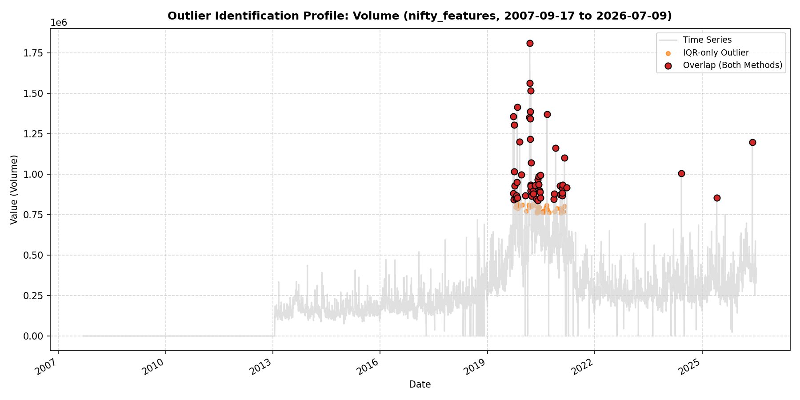
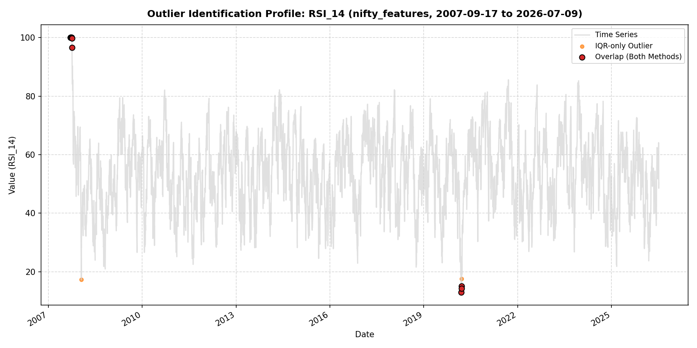
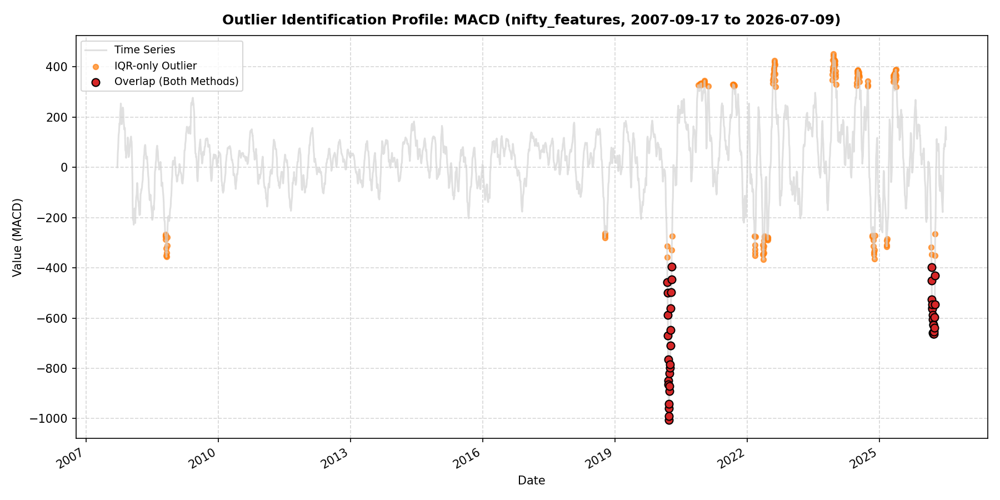
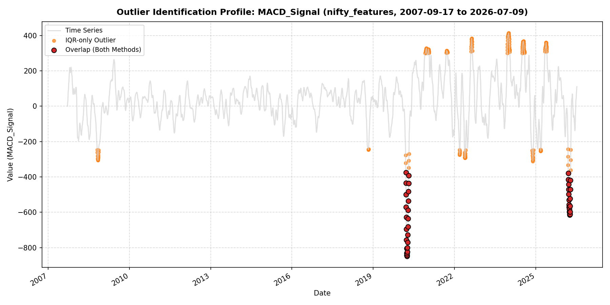
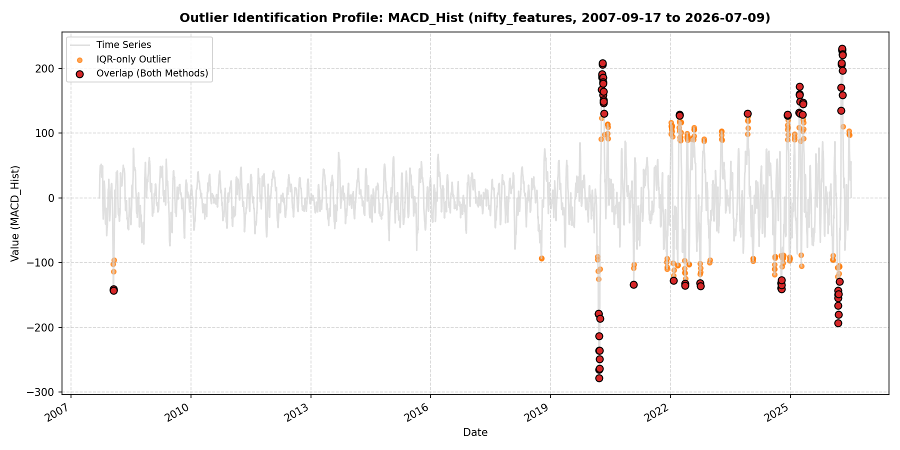
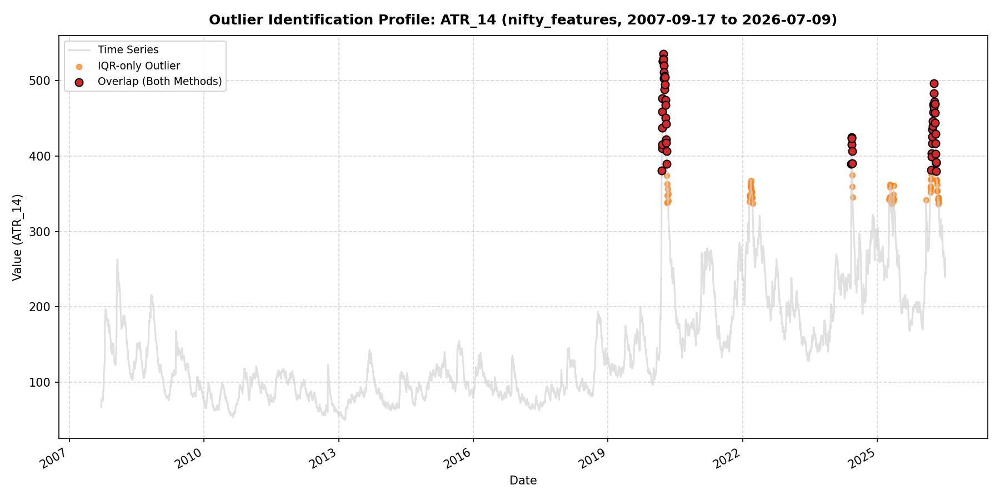
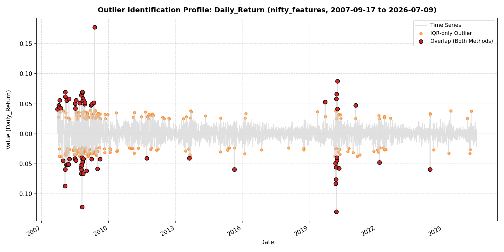
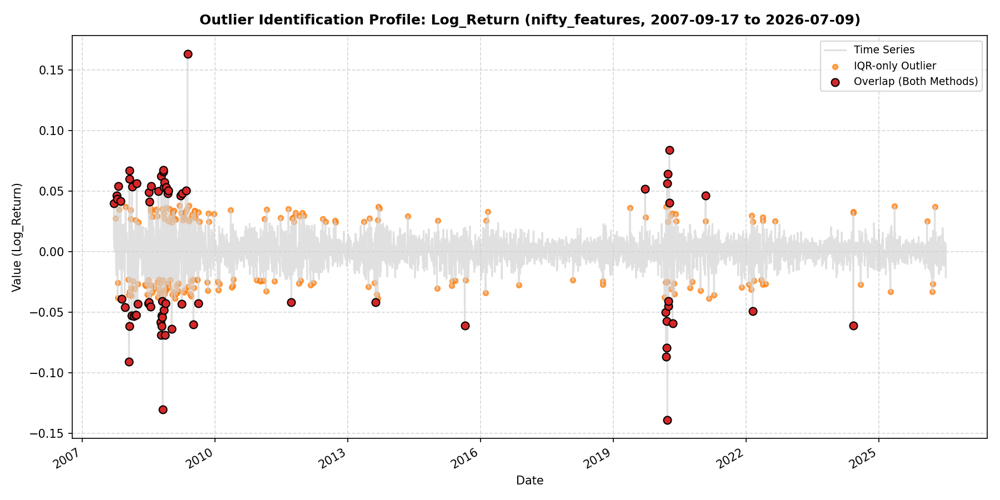

# QuantEngine: Statistical Outlier Analysis Report
**Report Generated At**: 2026-07-13 00:43:12
**Source Dataset**: `nifty_features`
**Configuration Limits**: IQR multiplier = 1.5 | Z-score threshold = 3.0

> [!IMPORTANT]
> **Standing Non-Action Statement:**
> *No outliers identified in this report have been removed, capped, or modified. This report is for visibility only. Any decision to treat a specific point as erroneous vs. a genuine market event is a human judgment call, not an automated one.*

## 1. Outlier Summary Metrics Table
| Column Name | IQR Count | IQR % | Z-Score Count | Z-Score % | Overlap Count | Overlap % |
| :--- | :--- | :--- | :--- | :--- | :--- | :--- |
| `Open` | 0 | 0.00% | 0 | 0.00% | 0 | 0.00% |
| `High` | 0 | 0.00% | 0 | 0.00% | 0 | 0.00% |
| `Low` | 0 | 0.00% | 0 | 0.00% | 0 | 0.00% |
| `Close` | 0 | 0.00% | 0 | 0.00% | 0 | 0.00% |
| `Adj Close` | 0 | 0.00% | 0 | 0.00% | 0 | 0.00% |
| `Volume` | 88 | 1.91% | 54 | 1.17% | 54 | 1.17% |
| `SMA_20` | 0 | 0.00% | 0 | 0.00% | 0 | 0.00% |
| `SMA_50` | 0 | 0.00% | 0 | 0.00% | 0 | 0.00% |
| `SMA_200` | 0 | 0.00% | 0 | 0.00% | 0 | 0.00% |
| `EMA_20` | 0 | 0.00% | 0 | 0.00% | 0 | 0.00% |
| `EMA_50` | 0 | 0.00% | 0 | 0.00% | 0 | 0.00% |
| `EMA_200` | 0 | 0.00% | 0 | 0.00% | 0 | 0.00% |
| `RSI_14` | 18 | 0.39% | 16 | 0.35% | 16 | 0.35% |
| `MACD` | 187 | 4.05% | 40 | 0.87% | 40 | 0.87% |
| `MACD_Signal` | 221 | 4.79% | 42 | 0.91% | 42 | 0.91% |
| `MACD_Hist` | 215 | 4.66% | 72 | 1.56% | 72 | 1.56% |
| `BB_Middle` | 0 | 0.00% | 0 | 0.00% | 0 | 0.00% |
| `BB_Upper` | 0 | 0.00% | 0 | 0.00% | 0 | 0.00% |
| `BB_Lower` | 0 | 0.00% | 0 | 0.00% | 0 | 0.00% |
| `ATR_14` | 120 | 2.60% | 57 | 1.24% | 57 | 1.24% |
| `Daily_Return` | 267 | 5.79% | 69 | 1.50% | 69 | 1.50% |
| `Log_Return` | 271 | 5.88% | 70 | 1.52% | 70 | 1.52% |

## 2. Chronological Outlier Clustering
Dates where multiple columns flagged overlap outliers simultaneously (indicating market shocks):

| Date | Columns Flagged Count | Flagged Columns List | Associated Market Event |
| :--- | :--- | :--- | :--- |
| `2007-09-19` | 3 | `Daily_Return`, `Log_Return`, `RSI_14` | Unexplained |
| `2007-10-09` | 2 | `Daily_Return`, `Log_Return` | Unexplained |
| `2007-10-15` | 2 | `Daily_Return`, `Log_Return` | Unexplained |
| `2007-10-23` | 2 | `Daily_Return`, `Log_Return` | Unexplained |
| `2007-11-14` | 2 | `Daily_Return`, `Log_Return` | Unexplained |
| `2007-12-17` | 2 | `Daily_Return`, `Log_Return` | Unexplained |
| `2008-01-21` | 2 | `Daily_Return`, `Log_Return` | Global financial crisis - Black Monday |
| `2008-01-22` | 3 | `Daily_Return`, `Log_Return`, `MACD_Hist` | Unexplained |
| `2008-01-23` | 3 | `Daily_Return`, `Log_Return`, `MACD_Hist` | Unexplained |
| `2008-01-25` | 2 | `Daily_Return`, `Log_Return` | Unexplained |
| `2008-02-11` | 2 | `Daily_Return`, `Log_Return` | Unexplained |
| `2008-02-14` | 2 | `Daily_Return`, `Log_Return` | Unexplained |
| `2008-03-03` | 2 | `Daily_Return`, `Log_Return` | Unexplained |
| `2008-03-13` | 2 | `Daily_Return`, `Log_Return` | Unexplained |
| `2008-03-17` | 2 | `Daily_Return`, `Log_Return` | Unexplained |
| `2008-03-25` | 2 | `Daily_Return`, `Log_Return` | Unexplained |
| `2008-03-31` | 2 | `Daily_Return`, `Log_Return` | Unexplained |
| `2008-06-27` | 2 | `Daily_Return`, `Log_Return` | Unexplained |
| `2008-07-02` | 2 | `Daily_Return`, `Log_Return` | Unexplained |
| `2008-07-03` | 2 | `Daily_Return`, `Log_Return` | Unexplained |
| `2008-07-09` | 2 | `Daily_Return`, `Log_Return` | Unexplained |
| `2008-07-15` | 2 | `Daily_Return`, `Log_Return` | Unexplained |
| `2008-07-23` | 2 | `Daily_Return`, `Log_Return` | Unexplained |
| `2008-09-19` | 2 | `Daily_Return`, `Log_Return` | Unexplained |
| `2008-10-06` | 2 | `Daily_Return`, `Log_Return` | Unexplained |
| `2008-10-10` | 2 | `Daily_Return`, `Log_Return` | Unexplained |
| `2008-10-13` | 2 | `Daily_Return`, `Log_Return` | Unexplained |
| `2008-10-15` | 2 | `Daily_Return`, `Log_Return` | Unexplained |
| `2008-10-17` | 2 | `Daily_Return`, `Log_Return` | Unexplained |
| `2008-10-22` | 2 | `Daily_Return`, `Log_Return` | Unexplained |
| `2008-10-23` | 2 | `Daily_Return`, `Log_Return` | Unexplained |
| `2008-10-24` | 2 | `Daily_Return`, `Log_Return` | Global financial crisis - Volatility spike |
| `2008-10-29` | 2 | `Daily_Return`, `Log_Return` | Unexplained |
| `2008-10-31` | 2 | `Daily_Return`, `Log_Return` | Unexplained |
| `2008-11-03` | 2 | `Daily_Return`, `Log_Return` | Unexplained |
| `2008-11-05` | 2 | `Daily_Return`, `Log_Return` | Unexplained |
| `2008-11-10` | 2 | `Daily_Return`, `Log_Return` | Unexplained |
| `2008-11-11` | 2 | `Daily_Return`, `Log_Return` | Unexplained |
| `2008-11-18` | 2 | `Daily_Return`, `Log_Return` | Unexplained |
| `2008-11-21` | 2 | `Daily_Return`, `Log_Return` | Unexplained |
| `2008-12-04` | 2 | `Daily_Return`, `Log_Return` | Unexplained |
| `2008-12-10` | 2 | `Daily_Return`, `Log_Return` | Unexplained |
| `2009-01-07` | 2 | `Daily_Return`, `Log_Return` | Unexplained |
| `2009-03-23` | 2 | `Daily_Return`, `Log_Return` | Unexplained |
| `2009-03-30` | 2 | `Daily_Return`, `Log_Return` | Unexplained |
| `2009-04-02` | 2 | `Daily_Return`, `Log_Return` | Unexplained |
| `2009-05-04` | 2 | `Daily_Return`, `Log_Return` | Unexplained |
| `2009-05-18` | 2 | `Daily_Return`, `Log_Return` | General election result — upper circuit halt |
| `2009-07-06` | 2 | `Daily_Return`, `Log_Return` | Unexplained |
| `2009-08-17` | 2 | `Daily_Return`, `Log_Return` | Unexplained |
| `2011-09-22` | 2 | `Daily_Return`, `Log_Return` | Unexplained |
| `2013-08-16` | 2 | `Daily_Return`, `Log_Return` | Unexplained |
| `2015-08-24` | 2 | `Daily_Return`, `Log_Return` | Unexplained |
| `2019-09-20` | 3 | `Daily_Return`, `Log_Return`, `Volume` | Unexplained |
| `2020-03-09` | 3 | `Daily_Return`, `Log_Return`, `Volume` | Unexplained |
| `2020-03-12` | 6 | `Daily_Return`, `Log_Return`, `MACD`, `MACD_Hist`, `RSI_14`, `Volume` | COVID-19 volatility window |
| `2020-03-13` | 4 | `ATR_14`, `MACD`, `MACD_Hist`, `Volume` | Unexplained |
| `2020-03-16` | 7 | `ATR_14`, `Daily_Return`, `Log_Return`, `MACD`, `MACD_Hist`, `MACD_Signal`, `Volume` | COVID-19 volatility window |
| `2020-03-17` | 5 | `ATR_14`, `MACD`, `MACD_Hist`, `MACD_Signal`, `Volume` | Unexplained |
| `2020-03-18` | 8 | `ATR_14`, `Daily_Return`, `Log_Return`, `MACD`, `MACD_Hist`, `MACD_Signal`, `RSI_14`, `Volume` | Unexplained |
| `2020-03-19` | 6 | `ATR_14`, `MACD`, `MACD_Hist`, `MACD_Signal`, `RSI_14`, `Volume` | Unexplained |
| `2020-03-20` | 7 | `ATR_14`, `Daily_Return`, `Log_Return`, `MACD`, `MACD_Hist`, `MACD_Signal`, `Volume` | Unexplained |
| `2020-03-23` | 6 | `ATR_14`, `Daily_Return`, `Log_Return`, `MACD`, `MACD_Hist`, `MACD_Signal` | COVID-19 crash |
| `2020-03-24` | 4 | `ATR_14`, `MACD`, `MACD_Hist`, `MACD_Signal` | Unexplained |
| `2020-03-25` | 6 | `ATR_14`, `Daily_Return`, `Log_Return`, `MACD`, `MACD_Hist`, `MACD_Signal` | Unexplained |
| `2020-03-26` | 4 | `ATR_14`, `MACD`, `MACD_Signal`, `Volume` | Unexplained |
| `2020-03-27` | 3 | `ATR_14`, `MACD`, `MACD_Signal` | Unexplained |
| `2020-03-30` | 5 | `ATR_14`, `Daily_Return`, `Log_Return`, `MACD`, `MACD_Signal` | Unexplained |
| `2020-03-31` | 3 | `ATR_14`, `MACD`, `MACD_Signal` | Unexplained |
| `2020-04-01` | 5 | `ATR_14`, `Daily_Return`, `Log_Return`, `MACD`, `MACD_Signal` | Unexplained |
| `2020-04-03` | 3 | `ATR_14`, `MACD`, `MACD_Signal` | Unexplained |
| `2020-04-07` | 5 | `ATR_14`, `Daily_Return`, `Log_Return`, `MACD`, `MACD_Signal` | COVID-19 volatility window |
| `2020-04-08` | 4 | `ATR_14`, `MACD`, `MACD_Signal`, `Volume` | Unexplained |
| `2020-04-09` | 6 | `ATR_14`, `Daily_Return`, `Log_Return`, `MACD`, `MACD_Hist`, `MACD_Signal` | Unexplained |
| `2020-04-13` | 4 | `ATR_14`, `MACD`, `MACD_Hist`, `MACD_Signal` | Unexplained |
| `2020-04-15` | 5 | `ATR_14`, `MACD`, `MACD_Hist`, `MACD_Signal`, `Volume` | Unexplained |
| `2020-04-16` | 4 | `ATR_14`, `MACD`, `MACD_Hist`, `MACD_Signal` | Unexplained |
| `2020-04-17` | 3 | `ATR_14`, `MACD_Hist`, `MACD_Signal` | Unexplained |
| `2020-04-20` | 3 | `ATR_14`, `MACD_Hist`, `MACD_Signal` | Unexplained |
| `2020-04-21` | 3 | `ATR_14`, `MACD_Hist`, `MACD_Signal` | Unexplained |
| `2020-04-22` | 3 | `ATR_14`, `MACD_Hist`, `MACD_Signal` | Unexplained |
| `2020-04-23` | 2 | `ATR_14`, `MACD_Hist` | Unexplained |
| `2020-04-30` | 2 | `MACD_Hist`, `Volume` | Unexplained |
| `2020-05-04` | 3 | `Daily_Return`, `Log_Return`, `MACD_Hist` | Unexplained |
| `2021-02-01` | 3 | `Daily_Return`, `Log_Return`, `Volume` | Unexplained |
| `2022-02-24` | 2 | `Daily_Return`, `Log_Return` | Unexplained |
| `2024-06-04` | 4 | `ATR_14`, `Daily_Return`, `Log_Return`, `Volume` | Unexplained |
| `2026-03-11` | 2 | `MACD`, `MACD_Hist` | Unexplained |
| `2026-03-12` | 2 | `MACD`, `MACD_Hist` | Unexplained |
| `2026-03-13` | 2 | `MACD`, `MACD_Hist` | Unexplained |
| `2026-03-16` | 4 | `ATR_14`, `MACD`, `MACD_Hist`, `MACD_Signal` | Unexplained |
| `2026-03-17` | 3 | `MACD`, `MACD_Hist`, `MACD_Signal` | Unexplained |
| `2026-03-18` | 2 | `MACD`, `MACD_Signal` | Unexplained |
| `2026-03-19` | 3 | `ATR_14`, `MACD`, `MACD_Signal` | Unexplained |
| `2026-03-20` | 3 | `ATR_14`, `MACD`, `MACD_Signal` | Unexplained |
| `2026-03-23` | 4 | `ATR_14`, `MACD`, `MACD_Hist`, `MACD_Signal` | Unexplained |
| `2026-03-24` | 3 | `ATR_14`, `MACD`, `MACD_Signal` | Unexplained |
| `2026-03-25` | 3 | `ATR_14`, `MACD`, `MACD_Signal` | Unexplained |
| `2026-03-27` | 3 | `ATR_14`, `MACD`, `MACD_Signal` | Unexplained |
| `2026-03-30` | 3 | `ATR_14`, `MACD`, `MACD_Signal` | Unexplained |
| `2026-04-01` | 3 | `ATR_14`, `MACD`, `MACD_Signal` | Unexplained |
| `2026-04-02` | 3 | `ATR_14`, `MACD`, `MACD_Signal` | Unexplained |
| `2026-04-06` | 3 | `ATR_14`, `MACD`, `MACD_Signal` | Unexplained |
| `2026-04-07` | 3 | `ATR_14`, `MACD`, `MACD_Signal` | Unexplained |
| `2026-04-08` | 4 | `ATR_14`, `MACD`, `MACD_Hist`, `MACD_Signal` | Unexplained |
| `2026-04-09` | 3 | `ATR_14`, `MACD_Hist`, `MACD_Signal` | Unexplained |
| `2026-04-10` | 3 | `ATR_14`, `MACD_Hist`, `MACD_Signal` | Unexplained |
| `2026-04-13` | 3 | `ATR_14`, `MACD_Hist`, `MACD_Signal` | Unexplained |
| `2026-04-15` | 2 | `ATR_14`, `MACD_Hist` | Unexplained |
| `2026-04-16` | 2 | `ATR_14`, `MACD_Hist` | Unexplained |
| `2026-04-17` | 2 | `ATR_14`, `MACD_Hist` | Unexplained |
| `2026-04-20` | 2 | `ATR_14`, `MACD_Hist` | Unexplained |
| `2026-04-21` | 2 | `ATR_14`, `MACD_Hist` | Unexplained |
| `2026-04-22` | 2 | `ATR_14`, `MACD_Hist` | Unexplained |
| `2026-04-23` | 2 | `ATR_14`, `MACD_Hist` | Unexplained |

## 3. Detailed Outlier Lists per Column
The tables below list the top 20 outliers (by deviation magnitude) flagged by the overlap method, categorized into **Explained** and **Unexplained**.

### `Volume` Outlier Detail
#### Explained / Expected Outliers
| Date | Value | Deviation from Mean | Context Note |
| :--- | :--- | :--- | :--- |
| `2020-03-12` | 1343500.0000 | +1126334.4461 | COVID-19 volatility window |

#### Unexplained Outliers (Potential Anomalies)
| Date | Value | Deviation from Mean | Context Note |
| :--- | :--- | :--- | :--- |
| `2020-03-06` | 1811000.0000 | +1593834.4461 | Unclassified extreme point |
| `2020-03-09` | 1565500.0000 | +1348334.4461 | Unclassified extreme point |
| `2020-03-18` | 1516600.0000 | +1299434.4461 | Unclassified extreme point |
| `2019-10-31` | 1414800.0000 | +1197634.4461 | Unclassified extreme point |
| `2020-03-13` | 1388000.0000 | +1170834.4461 | Unclassified extreme point |
| `2020-08-31` | 1371800.0000 | +1154634.4461 | Unclassified extreme point |
| `2019-09-20` | 1356800.0000 | +1139634.4461 | Unclassified extreme point |
| `2020-03-05` | 1352500.0000 | +1135334.4461 | Unclassified extreme point |
| `2019-10-01` | 1305400.0000 | +1088234.4461 | Unclassified extreme point |
| `2020-03-11` | 1218500.0000 | +1001334.4461 | Unclassified extreme point |
| `2019-11-26` | 1201300.0000 | +984134.4461 | Unclassified extreme point |
| `2026-05-29` | 1198000.0000 | +980834.4461 | Unclassified extreme point |
| `2020-11-27` | 1162400.0000 | +945234.4461 | Unclassified extreme point |
| `2021-02-26` | 1103600.0000 | +886434.4461 | Unclassified extreme point |
| `2020-03-20` | 1071500.0000 | +854334.4461 | Unclassified extreme point |
| `2019-10-03` | 1017500.0000 | +800334.4461 | Unclassified extreme point |
| `2024-06-04` | 1006100.0000 | +788934.4461 | Unclassified extreme point |
| `2019-12-11` | 997700.0000 | +780534.4461 | Unclassified extreme point |
| `2020-06-25` | 994200.0000 | +777034.4461 | Unclassified extreme point |

**Visual Outlier Chart**: 

---
### `RSI_14` Outlier Detail
#### Explained / Expected Outliers
| Date | Value | Deviation from Mean | Context Note |
| :--- | :--- | :--- | :--- |
| `2020-03-12` | 12.9418 | -41.0216 | COVID-19 volatility window |

#### Unexplained Outliers (Potential Anomalies)
| Date | Value | Deviation from Mean | Context Note |
| :--- | :--- | :--- | :--- |
| `2007-09-18` | 100.0000 | +46.0366 | Unclassified extreme point |
| `2007-09-19` | 100.0000 | +46.0366 | Unclassified extreme point |
| `2007-09-20` | 100.0000 | +46.0366 | Unclassified extreme point |
| `2007-09-21` | 100.0000 | +46.0366 | Unclassified extreme point |
| `2007-09-24` | 100.0000 | +46.0366 | Unclassified extreme point |
| `2007-09-25` | 100.0000 | +46.0366 | Unclassified extreme point |
| `2007-09-26` | 100.0000 | +46.0366 | Unclassified extreme point |
| `2007-09-27` | 100.0000 | +46.0366 | Unclassified extreme point |
| `2007-09-28` | 100.0000 | +46.0366 | Unclassified extreme point |
| `2007-10-01` | 100.0000 | +46.0366 | Unclassified extreme point |
| `2007-10-03` | 100.0000 | +46.0366 | Unclassified extreme point |
| `2007-10-04` | 99.7185 | +45.7550 | Unclassified extreme point |
| `2007-10-05` | 96.6119 | +42.6485 | Unclassified extreme point |
| `2020-03-19` | 14.2229 | -39.7405 | Unclassified extreme point |
| `2020-03-18` | 15.0938 | -38.8696 | Unclassified extreme point |

**Visual Outlier Chart**: 

---
### `MACD` Outlier Detail
#### Explained / Expected Outliers
| Date | Value | Deviation from Mean | Context Note |
| :--- | :--- | :--- | :--- |
| `2020-03-23` | -958.5400 | -987.9304 | COVID-19 crash |
| `2020-04-07` | -710.2936 | -739.6840 | COVID-19 volatility window |

#### Unexplained Outliers (Potential Anomalies)
| Date | Value | Deviation from Mean | Context Note |
| :--- | :--- | :--- | :--- |
| `2020-03-24` | -1005.8375 | -1035.2279 | Unclassified extreme point |
| `2020-03-25` | -990.2052 | -1019.5956 | Unclassified extreme point |
| `2020-03-26` | -940.8589 | -970.2494 | Unclassified extreme point |
| `2020-03-27` | -889.9756 | -919.3660 | Unclassified extreme point |
| `2020-03-30` | -870.2132 | -899.6037 | Unclassified extreme point |
| `2020-03-20` | -864.8019 | -894.1923 | Unclassified extreme point |
| `2020-03-19` | -848.1632 | -877.5536 | Unclassified extreme point |
| `2020-03-31` | -819.5531 | -848.9435 | Unclassified extreme point |
| `2020-04-01` | -797.9600 | -827.3504 | Unclassified extreme point |
| `2020-04-03` | -785.5101 | -814.9005 | Unclassified extreme point |
| `2020-03-18` | -765.5128 | -794.9032 | Unclassified extreme point |
| `2020-03-17` | -669.7944 | -699.1848 | Unclassified extreme point |
| `2026-03-30` | -662.9273 | -692.3177 | Unclassified extreme point |
| `2026-03-24` | -662.0002 | -691.3907 | Unclassified extreme point |
| `2026-03-23` | -658.7851 | -688.1755 | Unclassified extreme point |
| `2026-04-01` | -654.4403 | -683.8308 | Unclassified extreme point |
| `2020-04-08` | -646.7349 | -676.1254 | Unclassified extreme point |
| `2026-04-02` | -637.6448 | -667.0352 | Unclassified extreme point |

**Visual Outlier Chart**: 

---
### `MACD_Signal` Outlier Detail
#### Explained / Expected Outliers
| Date | Value | Deviation from Mean | Context Note |
| :--- | :--- | :--- | :--- |
| `2020-04-07` | -801.2786 | -830.5733 | COVID-19 volatility window |
| `2020-03-23` | -694.7902 | -724.0850 | COVID-19 crash |

#### Unexplained Outliers (Potential Anomalies)
| Date | Value | Deviation from Mean | Context Note |
| :--- | :--- | :--- | :--- |
| `2020-03-30` | -848.3328 | -877.6275 | Unclassified extreme point |
| `2020-03-27` | -842.8626 | -872.1574 | Unclassified extreme point |
| `2020-03-31` | -842.5768 | -871.8716 | Unclassified extreme point |
| `2020-04-01` | -833.6535 | -862.9483 | Unclassified extreme point |
| `2020-03-26` | -831.0844 | -860.3792 | Unclassified extreme point |
| `2020-04-03` | -824.0248 | -853.3196 | Unclassified extreme point |
| `2020-03-25` | -803.6407 | -832.9355 | Unclassified extreme point |
| `2020-04-08` | -770.3698 | -799.6646 | Unclassified extreme point |
| `2020-03-24` | -756.9996 | -786.2944 | Unclassified extreme point |
| `2020-04-09` | -728.4156 | -757.7104 | Unclassified extreme point |
| `2020-04-13` | -681.9608 | -711.2556 | Unclassified extreme point |
| `2020-04-15` | -634.6598 | -663.9546 | Unclassified extreme point |
| `2020-03-20` | -628.8527 | -658.1475 | Unclassified extreme point |
| `2026-04-02` | -614.9439 | -644.2387 | Unclassified extreme point |
| `2026-04-06` | -611.3282 | -640.6230 | Unclassified extreme point |
| `2026-04-01` | -609.2687 | -638.5635 | Unclassified extreme point |
| `2026-04-07` | -598.2060 | -627.5008 | Unclassified extreme point |
| `2026-03-30` | -597.9758 | -627.2706 | Unclassified extreme point |

**Visual Outlier Chart**: 

---
### `MACD_Hist` Outlier Detail
#### Explained / Expected Outliers
| Date | Value | Deviation from Mean | Context Note |
| :--- | :--- | :--- | :--- |
| `2020-03-23` | -263.7498 | -263.8454 | COVID-19 crash |
| `2020-03-16` | -213.5780 | -213.6737 | COVID-19 volatility window |

#### Unexplained Outliers (Potential Anomalies)
| Date | Value | Deviation from Mean | Context Note |
| :--- | :--- | :--- | :--- |
| `2020-03-19` | -278.2977 | -278.3933 | Unclassified extreme point |
| `2020-03-18` | -265.2218 | -265.3174 | Unclassified extreme point |
| `2020-03-24` | -248.8378 | -248.9334 | Unclassified extreme point |
| `2020-03-20` | -235.9492 | -236.0448 | Unclassified extreme point |
| `2020-03-17` | -235.8088 | -235.9044 | Unclassified extreme point |
| `2026-04-17` | 230.5792 | +230.4836 | Unclassified extreme point |
| `2026-04-16` | 229.0251 | +228.9295 | Unclassified extreme point |
| `2026-04-15` | 227.7799 | +227.6842 | Unclassified extreme point |
| `2026-04-20` | 222.4343 | +222.3387 | Unclassified extreme point |
| `2026-04-21` | 220.9226 | +220.8270 | Unclassified extreme point |
| `2026-04-13` | 208.4813 | +208.3857 | Unclassified extreme point |
| `2020-04-20` | 208.4390 | +208.3434 | Unclassified extreme point |
| `2026-04-10` | 205.9115 | +205.8159 | Unclassified extreme point |
| `2020-04-17` | 205.7348 | +205.6391 | Unclassified extreme point |
| `2026-04-22` | 196.9630 | +196.8674 | Unclassified extreme point |
| `2026-03-13` | -193.0131 | -193.1088 | Unclassified extreme point |
| `2020-04-16` | 191.5013 | +191.4057 | Unclassified extreme point |
| `2020-04-15` | 189.2042 | +189.1086 | Unclassified extreme point |

**Visual Outlier Chart**: 

---
### `ATR_14` Outlier Detail
#### Explained / Expected Outliers
| Date | Value | Deviation from Mean | Context Note |
| :--- | :--- | :--- | :--- |
| `2020-03-23` | 525.7250 | +378.8873 | COVID-19 crash |
| `2020-04-07` | 506.4345 | +359.5968 | COVID-19 volatility window |

#### Unexplained Outliers (Potential Anomalies)
| Date | Value | Deviation from Mean | Context Note |
| :--- | :--- | :--- | :--- |
| `2020-03-25` | 535.4672 | +388.6296 | Unclassified extreme point |
| `2020-03-26` | 528.9445 | +382.1069 | Unclassified extreme point |
| `2020-03-27` | 528.0199 | +381.1822 | Unclassified extreme point |
| `2020-03-24` | 525.7339 | +378.8963 | Unclassified extreme point |
| `2020-03-30` | 520.0363 | +373.1987 | Unclassified extreme point |
| `2020-03-31` | 511.2623 | +364.4247 | Unclassified extreme point |
| `2020-04-08` | 504.3892 | +357.5515 | Unclassified extreme point |
| `2020-04-01` | 503.2722 | +356.4345 | Unclassified extreme point |
| `2026-04-08` | 496.3129 | +349.4752 | Unclassified extreme point |
| `2020-04-09` | 495.4756 | +348.6379 | Unclassified extreme point |
| `2020-04-03` | 488.8063 | +341.9687 | Unclassified extreme point |
| `2026-04-09` | 483.3297 | +336.4921 | Unclassified extreme point |
| `2020-03-20` | 476.7923 | +329.9546 | Unclassified extreme point |
| `2020-04-13` | 474.3452 | +327.5075 | Unclassified extreme point |
| `2026-04-13` | 471.9341 | +325.0965 | Unclassified extreme point |
| `2026-04-10` | 470.1598 | +323.3222 | Unclassified extreme point |
| `2026-04-15` | 469.5281 | +322.6905 | Unclassified extreme point |
| `2026-04-02` | 468.4288 | +321.5911 | Unclassified extreme point |

**Visual Outlier Chart**: 

---
### `Daily_Return` Outlier Detail
#### Explained / Expected Outliers
| Date | Value | Deviation from Mean | Context Note |
| :--- | :--- | :--- | :--- |
| `2009-05-18` | 0.1774 | +0.1770 | General election result — upper circuit halt |
| `2020-03-23` | -0.1298 | -0.1303 | COVID-19 crash |
| `2008-10-24` | -0.1220 | -0.1225 | Global financial crisis - Volatility spike |
| `2008-01-21` | -0.0870 | -0.0875 | Global financial crisis - Black Monday |
| `2020-04-07` | 0.0876 | +0.0872 | COVID-19 volatility window |
| `2020-03-12` | -0.0830 | -0.0835 | COVID-19 volatility window |
| `2020-03-16` | -0.0761 | -0.0766 | COVID-19 volatility window |

#### Unexplained Outliers (Potential Anomalies)
| Date | Value | Deviation from Mean | Context Note |
| :--- | :--- | :--- | :--- |
| `2008-10-31` | 0.0699 | +0.0695 | Unclassified extreme point |
| `2008-01-25` | 0.0695 | +0.0691 | Unclassified extreme point |
| `2008-10-29` | 0.0685 | +0.0680 | Unclassified extreme point |
| `2008-11-11` | -0.0666 | -0.0670 | Unclassified extreme point |
| `2008-10-10` | -0.0665 | -0.0670 | Unclassified extreme point |
| `2020-03-25` | 0.0662 | +0.0658 | Unclassified extreme point |
| `2008-10-13` | 0.0643 | +0.0638 | Unclassified extreme point |
| `2009-01-07` | -0.0618 | -0.0623 | Unclassified extreme point |
| `2008-01-23` | 0.0621 | +0.0616 | Unclassified extreme point |
| `2008-10-17` | -0.0596 | -0.0601 | Unclassified extreme point |
| `2008-01-22` | -0.0594 | -0.0599 | Unclassified extreme point |
| `2024-06-04` | -0.0593 | -0.0597 | Unclassified extreme point |
| `2015-08-24` | -0.0592 | -0.0596 | Unclassified extreme point |

**Visual Outlier Chart**: 

---
### `Log_Return` Outlier Detail
#### Explained / Expected Outliers
| Date | Value | Deviation from Mean | Context Note |
| :--- | :--- | :--- | :--- |
| `2009-05-18` | 0.1633 | +0.1630 | General election result — upper circuit halt |
| `2020-03-23` | -0.1390 | -0.1394 | COVID-19 crash |
| `2008-10-24` | -0.1301 | -0.1305 | Global financial crisis - Volatility spike |
| `2008-01-21` | -0.0910 | -0.0914 | Global financial crisis - Black Monday |
| `2020-03-12` | -0.0867 | -0.0870 | COVID-19 volatility window |
| `2020-04-07` | 0.0840 | +0.0836 | COVID-19 volatility window |
| `2020-03-16` | -0.0792 | -0.0795 | COVID-19 volatility window |

#### Unexplained Outliers (Potential Anomalies)
| Date | Value | Deviation from Mean | Context Note |
| :--- | :--- | :--- | :--- |
| `2008-11-11` | -0.0689 | -0.0693 | Unclassified extreme point |
| `2008-10-10` | -0.0688 | -0.0692 | Unclassified extreme point |
| `2008-10-31` | 0.0676 | +0.0672 | Unclassified extreme point |
| `2008-01-25` | 0.0672 | +0.0668 | Unclassified extreme point |
| `2008-10-29` | 0.0662 | +0.0659 | Unclassified extreme point |
| `2009-01-07` | -0.0638 | -0.0642 | Unclassified extreme point |
| `2020-03-25` | 0.0641 | +0.0638 | Unclassified extreme point |
| `2008-10-13` | 0.0623 | +0.0619 | Unclassified extreme point |
| `2008-10-17` | -0.0615 | -0.0618 | Unclassified extreme point |
| `2008-01-22` | -0.0613 | -0.0616 | Unclassified extreme point |
| `2024-06-04` | -0.0611 | -0.0615 | Unclassified extreme point |
| `2015-08-24` | -0.0610 | -0.0613 | Unclassified extreme point |
| `2009-07-06` | -0.0602 | -0.0606 | Unclassified extreme point |

**Visual Outlier Chart**: 

---