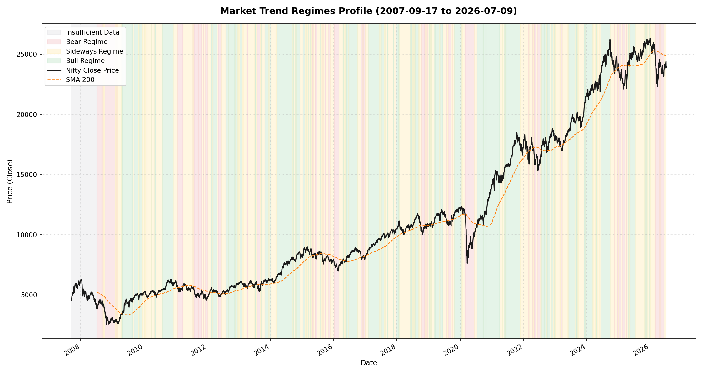

# QuantEngine: Market Regime Analysis Report
**Report Generated At**: 2026-07-15 23:10:06
**Source Dataset**: `nifty_features`
**Configuration Parameters**:
- Trend Lookback Window: 63 sessions (approx. 1 quarter)
- Trend Threshold: ±5.0%
- Volatility Window: 21 sessions
- High Volatility Cutoff: 75th percentile of history (0.012251)
- Low Volatility Cutoff: 25th percentile of history (0.006827)

## 1. Important Caveat & Structural Warning
> [!WARNING]
> **Lookahead-Bias and Time Lag Warning:**
> Regime labels defined in this report are strictly computed using **backward-looking rolling windows** (no future data is referenced), making them technically free of lookahead-bias. However, a trend label (Bull/Bear/Sideways) assigned to *today* using a 63-day trailing window is, by definition, a description of **recent past behavior** rather than a real-time signal.
>
> As a result, there is a structural **lag** between actual regime shifts and the window crossing the configured threshold (e.g., a new Bear market won't be labeled 'Bear' until index returns drop below the threshold). This lag is perfectly acceptable for retrospective model evaluation (which is the purpose of this analysis), but these regime labels should **never** be fed directly into a predictive model as same-day features, as this lag would inject severe classification errors and feedback loops.

> [!NOTE]
> **Zero-Volume Limitation Validation:**
> The Nifty zero-volume limitation period (2007–2013) identified in Step 5 does **not** distort the volatility regimes. Volatility regimes are computed entirely using standard deviation of returns (`Daily_Return`) derived from price Close series, not `Volume`. Hence, historical zero-volume years have zero distortion effect on the volatility classifications below.

## 2. Per-Regime Statistics
### Trend Regime Performance Metrics
| Regime | Period Count | Total Trading Days | Mean Daily Return | Median Daily Return | Volatility (Std Dev) | Avg Trading Days per Period | Avg Calendar Days |
| :--- | :--- | :--- | :--- | :--- | :--- | :--- | :--- |
| **Bear** | 71 | 719 | -0.1838% | -0.1426% | 2.0149% | 10.1 | 13.7 |
| **Sideways** | 194 | 1978 | +0.0275% | +0.0209% | 1.0045% | 10.2 | 13.7 |
| **Bull** | 123 | 1716 | +0.1688% | +0.1519% | 1.0164% | 14.0 | 19.2 |

### Volatility Regime Performance Metrics
| Regime | Period Count | Total Trading Days | Mean Daily Return | Median Daily Return | Volatility (Std Dev) | Avg Trading Days per Period | Avg Calendar Days |
| :--- | :--- | :--- | :--- | :--- | :--- | :--- | :--- |
| **High** | 48 | 1148 | +0.0687% | +0.1130% | 2.1461% | 23.9 | 34.5 |
| **Normal** | 119 | 2296 | +0.0195% | +0.0436% | 0.9335% | 19.3 | 27.2 |
| **Low** | 71 | 1148 | +0.0514% | +0.0596% | 0.5893% | 16.2 | 22.4 |

## 3. Two-Dimensional Cross-Tabulation Matrix (Trend × Volatility)
Co-occurrence of trend and volatility dimensions (counts in trading days):
| Trend Regime / Volatility | High | Insufficient Data | Low | Normal | All |
| :--- | :--- | :--- | :--- | :--- | :--- |
| **Bear** | 392 | 0 | 24 | 303 | 719 |
| **Bull** | 233 | 0 | 673 | 810 | 1716 |
| **Insufficient Data** | 171 | 21 | 0 | 8 | 200 |
| **Sideways** | 352 | 0 | 451 | 1175 | 1978 |
| **All** | 1148 | 21 | 1148 | 2296 | 4613 |

## 4. Regime Timeline Visualization
The timeline below plots the Close price overlaying colored bands representing trend regimes:

## 5. Contiguous Trend Regime Period Timeline
| Period Rank | Start Date | End Date | Trend Regime | Trading Days | Calendar Days | Start Price | End Price | Overlapping Known Market Events |
| :--- | :--- | :--- | :--- | :--- | :--- | :--- | :--- | :--- |
| 1 | `2007-09-17` | `2008-07-07` | **Insufficient Data** | 200 | 294 | 4494.65 | 4030.00 | Global Financial Crisis, RSI Warm-Up Boundary Artifact, Volume Index Feed Limitation |
| 2 | `2008-07-08` | `2008-09-01` | **Bear** | 39 | 55 | 3988.55 | 4348.65 | Global Financial Crisis, Volume Index Feed Limitation |
| 3 | `2008-09-02` | `2008-09-04` | **Sideways** | 2 | 2 | 4504.00 | 4447.75 | Global Financial Crisis, Volume Index Feed Limitation |
| 4 | `2008-09-05` | `2008-09-05` | **Bear** | 1 | 0 | 4352.30 | 4352.30 | Global Financial Crisis, Volume Index Feed Limitation |
| 5 | `2008-09-08` | `2008-09-10` | **Sideways** | 3 | 2 | 4482.30 | 4400.25 | Global Financial Crisis, Volume Index Feed Limitation |
| 6 | `2008-09-11` | `2008-09-18` | **Bear** | 6 | 7 | 4290.30 | 4038.15 | Global Financial Crisis, Volume Index Feed Limitation |
| 7 | `2008-09-19` | `2008-10-03` | **Sideways** | 10 | 14 | 4245.25 | 3818.30 | Global Financial Crisis, Volume Index Feed Limitation |
| 8 | `2008-10-06` | `2009-02-02` | **Bear** | 76 | 119 | 3602.35 | 2766.65 | Global Financial Crisis, Volume Index Feed Limitation |
| 9 | `2009-02-03` | `2009-02-09` | **Sideways** | 5 | 6 | 2783.90 | 2919.90 | Global Financial Crisis, Volume Index Feed Limitation |
| 10 | `2009-02-10` | `2009-02-10` | **Bear** | 1 | 0 | 2934.50 | 2934.50 | Global Financial Crisis, Volume Index Feed Limitation |
| 11 | `2009-02-11` | `2009-02-13` | **Sideways** | 3 | 2 | 2925.70 | 2948.35 | Global Financial Crisis, Volume Index Feed Limitation |
| 12 | `2009-02-16` | `2009-02-17` | **Bear** | 2 | 1 | 2848.50 | 2770.50 | Global Financial Crisis, Volume Index Feed Limitation |
| 13 | `2009-02-18` | `2009-03-04` | **Sideways** | 10 | 14 | 2776.15 | 2645.20 | Global Financial Crisis, Volume Index Feed Limitation |
| 14 | `2009-03-05` | `2009-03-05` | **Bear** | 1 | 0 | 2576.70 | 2576.70 | Global Financial Crisis, Volume Index Feed Limitation |
| 15 | `2009-03-06` | `2009-04-13` | **Sideways** | 22 | 38 | 2620.15 | 3382.60 | Global Financial Crisis, Volume Index Feed Limitation |
| 16 | `2009-04-15` | `2009-04-15` | **Bull** | 1 | 0 | 3484.15 | 3484.15 | Volume Index Feed Limitation |
| 17 | `2009-04-16` | `2009-04-22` | **Sideways** | 5 | 6 | 3369.50 | 3330.30 | Volume Index Feed Limitation |
| 18 | `2009-04-23` | `2009-04-27` | **Bull** | 3 | 4 | 3423.70 | 3470.00 | Volume Index Feed Limitation |
| 19 | `2009-04-28` | `2009-04-28` | **Sideways** | 1 | 0 | 3362.35 | 3362.35 | Volume Index Feed Limitation |
| 20 | `2009-04-29` | `2009-08-14` | **Bull** | 76 | 107 | 3473.95 | 4580.05 | 2009 Election Rally, Volume Index Feed Limitation |
| 21 | `2009-08-17` | `2009-08-17` | **Sideways** | 1 | 0 | 4387.90 | 4387.90 | Volume Index Feed Limitation |
| 22 | `2009-08-18` | `2009-08-18` | **Bull** | 1 | 0 | 4458.90 | 4458.90 | Volume Index Feed Limitation |
| 23 | `2009-08-19` | `2009-08-19` | **Sideways** | 1 | 0 | 4394.10 | 4394.10 | Volume Index Feed Limitation |
| 24 | `2009-08-20` | `2009-08-26` | **Bull** | 5 | 6 | 4453.45 | 4680.85 | Volume Index Feed Limitation |
| 25 | `2009-08-27` | `2009-09-08` | **Sideways** | 9 | 12 | 4688.20 | 4805.25 | Volume Index Feed Limitation |
| 26 | `2009-09-09` | `2009-10-28` | **Bull** | 31 | 49 | 4814.25 | 4826.15 | Volume Index Feed Limitation |
| 27 | `2009-10-29` | `2009-11-10` | **Sideways** | 8 | 12 | 4750.55 | 4881.70 | Volume Index Feed Limitation |
| 28 | `2009-11-11` | `2009-12-14` | **Bull** | 24 | 33 | 5003.95 | 5105.70 | Volume Index Feed Limitation |
| 29 | `2009-12-15` | `2009-12-31` | **Sideways** | 11 | 16 | 5033.05 | 5201.05 | Volume Index Feed Limitation |
| 30 | `2010-01-04` | `2010-01-05` | **Bull** | 2 | 1 | 5232.20 | 5277.90 | Volume Index Feed Limitation |
| 31 | `2010-01-06` | `2010-01-13` | **Sideways** | 6 | 7 | 5281.80 | 5233.95 | Volume Index Feed Limitation |
| 32 | `2010-01-14` | `2010-01-14` | **Bull** | 1 | 0 | 5259.90 | 5259.90 | Volume Index Feed Limitation |
| 33 | `2010-01-15` | `2010-02-03` | **Sideways** | 13 | 19 | 5252.20 | 4931.85 | Volume Index Feed Limitation |
| 34 | `2010-02-04` | `2010-02-04` | **Bull** | 1 | 0 | 4845.35 | 4845.35 | Volume Index Feed Limitation |
| 35 | `2010-02-05` | `2010-03-25` | **Sideways** | 32 | 48 | 4718.65 | 5260.40 | Volume Index Feed Limitation |
| 36 | `2010-03-26` | `2010-03-30` | **Bull** | 3 | 4 | 5282.00 | 5262.45 | Volume Index Feed Limitation |
| 37 | `2010-03-31` | `2010-04-29` | **Sideways** | 20 | 29 | 5249.10 | 5254.15 | Volume Index Feed Limitation |
| 38 | `2010-04-30` | `2010-05-04` | **Bull** | 3 | 4 | 5278.00 | 5148.50 | Volume Index Feed Limitation |
| 39 | `2010-05-05` | `2010-05-07` | **Sideways** | 3 | 2 | 5124.90 | 5018.05 | Volume Index Feed Limitation |
| 40 | `2010-05-10` | `2010-05-17` | **Bull** | 6 | 7 | 5193.60 | 5059.90 | Volume Index Feed Limitation |
| 41 | `2010-05-18` | `2010-07-30` | **Sideways** | 54 | 73 | 5066.20 | 5367.60 | Volume Index Feed Limitation |
| 42 | `2010-08-02` | `2010-08-04` | **Bull** | 3 | 2 | 5431.65 | 5467.85 | Volume Index Feed Limitation |
| 43 | `2010-08-05` | `2010-08-05` | **Sideways** | 1 | 0 | 5447.10 | 5447.10 | Volume Index Feed Limitation |
| 44 | `2010-08-06` | `2010-12-08` | **Bull** | 86 | 124 | 5439.25 | 5903.70 | Volume Index Feed Limitation |
| 45 | `2010-12-09` | `2011-01-25` | **Sideways** | 33 | 47 | 5766.50 | 5687.40 | Volume Index Feed Limitation |
| 46 | `2011-01-27` | `2011-03-25` | **Bear** | 41 | 57 | 5604.30 | 5654.25 | Volume Index Feed Limitation |
| 47 | `2011-03-28` | `2011-07-11` | **Sideways** | 72 | 105 | 5687.25 | 5616.10 | Volume Index Feed Limitation |
| 48 | `2011-07-12` | `2011-07-12` | **Bear** | 1 | 0 | 5526.15 | 5526.15 | Volume Index Feed Limitation |
| 49 | `2011-07-13` | `2011-07-13` | **Sideways** | 1 | 0 | 5585.45 | 5585.45 | Volume Index Feed Limitation |
| 50 | `2011-07-15` | `2011-07-15` | **Bear** | 1 | 0 | 5581.10 | 5581.10 | Volume Index Feed Limitation |
| 51 | `2011-07-18` | `2011-07-20` | **Sideways** | 3 | 2 | 5567.05 | 5567.05 | Volume Index Feed Limitation |
| 52 | `2011-07-21` | `2011-07-21` | **Bear** | 1 | 0 | 5541.60 | 5541.60 | Volume Index Feed Limitation |
| 53 | `2011-07-22` | `2011-07-25` | **Sideways** | 2 | 3 | 5633.95 | 5680.30 | Volume Index Feed Limitation |
| 54 | `2011-07-26` | `2011-07-26` | **Bear** | 1 | 0 | 5574.85 | 5574.85 | Volume Index Feed Limitation |
| 55 | `2011-07-27` | `2011-07-27` | **Sideways** | 1 | 0 | 5546.80 | 5546.80 | Volume Index Feed Limitation |
| 56 | `2011-07-28` | `2011-07-28` | **Bear** | 1 | 0 | 5487.75 | 5487.75 | Volume Index Feed Limitation |
| 57 | `2011-07-29` | `2011-08-04` | **Sideways** | 5 | 6 | 5482.00 | 5331.80 | Volume Index Feed Limitation |
| 58 | `2011-08-05` | `2011-09-19` | **Bear** | 29 | 45 | 5211.25 | 5031.95 | Volume Index Feed Limitation |
| 59 | `2011-09-20` | `2011-09-21` | **Sideways** | 2 | 1 | 5140.20 | 5133.25 | Volume Index Feed Limitation |
| 60 | `2011-09-22` | `2011-10-28` | **Bear** | 24 | 36 | 4923.65 | 5360.70 | Volume Index Feed Limitation |
| 61 | `2011-10-31` | `2011-10-31` | **Sideways** | 1 | 0 | 5326.60 | 5326.60 | Volume Index Feed Limitation |
| 62 | `2011-11-01` | `2011-11-01` | **Bear** | 1 | 0 | 5257.95 | 5257.95 | Volume Index Feed Limitation |
| 63 | `2011-11-02` | `2011-11-18` | **Sideways** | 11 | 16 | 5258.45 | 4905.80 | Volume Index Feed Limitation |
| 64 | `2011-11-21` | `2011-11-21` | **Bear** | 1 | 0 | 4778.35 | 4778.35 | Volume Index Feed Limitation |
| 65 | `2011-11-22` | `2011-11-22` | **Sideways** | 1 | 0 | 4812.35 | 4812.35 | Volume Index Feed Limitation |
| 66 | `2011-11-23` | `2011-11-23` | **Bear** | 1 | 0 | 4706.45 | 4706.45 | Volume Index Feed Limitation |
| 67 | `2011-11-25` | `2011-12-09` | **Sideways** | 10 | 14 | 4710.05 | 4866.70 | Volume Index Feed Limitation |
| 68 | `2011-12-12` | `2011-12-30` | **Bear** | 14 | 18 | 4764.60 | 4624.30 | Volume Index Feed Limitation |
| 69 | `2012-01-03` | `2012-01-06` | **Sideways** | 4 | 3 | 4765.30 | 4754.10 | Volume Index Feed Limitation |
| 70 | `2012-01-09` | `2012-01-09` | **Bear** | 1 | 0 | 4742.80 | 4742.80 | Volume Index Feed Limitation |
| 71 | `2012-01-10` | `2012-02-14` | **Sideways** | 25 | 35 | 4849.55 | 5416.05 | Volume Index Feed Limitation |
| 72 | `2012-02-15` | `2012-03-06` | **Bull** | 14 | 20 | 5531.95 | 5222.40 | Volume Index Feed Limitation |
| 73 | `2012-03-07` | `2012-03-07` | **Sideways** | 1 | 0 | 5220.45 | 5220.45 | Volume Index Feed Limitation |
| 74 | `2012-03-09` | `2012-04-20` | **Bull** | 29 | 42 | 5333.55 | 5290.85 | Volume Index Feed Limitation |
| 75 | `2012-04-23` | `2012-05-07` | **Sideways** | 10 | 14 | 5200.60 | 5114.15 | Volume Index Feed Limitation |
| 76 | `2012-05-08` | `2012-06-06` | **Bear** | 21 | 29 | 4999.95 | 4997.10 | Volume Index Feed Limitation |
| 77 | `2012-06-07` | `2012-06-13` | **Sideways** | 5 | 6 | 5049.65 | 5121.45 | Volume Index Feed Limitation |
| 78 | `2012-06-14` | `2012-06-14` | **Bear** | 1 | 0 | 5054.75 | 5054.75 | Volume Index Feed Limitation |
| 79 | `2012-06-15` | `2012-06-15` | **Sideways** | 1 | 0 | 5139.05 | 5139.05 | Volume Index Feed Limitation |
| 80 | `2012-06-18` | `2012-06-18` | **Bear** | 1 | 0 | 5064.25 | 5064.25 | Volume Index Feed Limitation |
| 81 | `2012-06-19` | `2012-08-03` | **Sideways** | 34 | 45 | 5103.85 | 5215.70 | Volume Index Feed Limitation |
| 82 | `2012-08-06` | `2012-09-05` | **Bull** | 20 | 30 | 5282.55 | 5225.70 | Volume Index Feed Limitation |
| 83 | `2012-09-06` | `2012-09-06` | **Sideways** | 1 | 0 | 5238.40 | 5238.40 | Volume Index Feed Limitation |
| 84 | `2012-09-07` | `2012-11-15` | **Bull** | 44 | 69 | 5342.10 | 5631.00 | Volume Index Feed Limitation |
| 85 | `2012-11-16` | `2012-11-23` | **Sideways** | 6 | 7 | 5574.05 | 5626.60 | Volume Index Feed Limitation |
| 86 | `2012-11-26` | `2012-12-20` | **Bull** | 18 | 24 | 5635.90 | 5916.40 | Volume Index Feed Limitation |
| 87 | `2012-12-21` | `2012-12-24` | **Sideways** | 2 | 3 | 5847.70 | 5855.75 | Volume Index Feed Limitation |
| 88 | `2012-12-26` | `2012-12-27` | **Bull** | 2 | 1 | 5905.60 | 5870.10 | Volume Index Feed Limitation |
| 89 | `2012-12-28` | `2012-12-31` | **Sideways** | 2 | 3 | 5908.35 | 5905.10 | Volume Index Feed Limitation |
| 90 | `2013-01-02` | `2013-01-04` | **Bull** | 3 | 2 | 5993.25 | 6016.15 | Volume Index Feed Limitation |
| 91 | `2013-01-07` | `2013-01-11` | **Sideways** | 5 | 4 | 5988.40 | 5951.30 | Volume Index Feed Limitation |
| 92 | `2013-01-14` | `2013-02-05` | **Bull** | 17 | 22 | 6024.05 | 5956.90 | Volume Index Feed Limitation |
| 93 | `2013-02-06` | `2013-02-15` | **Sideways** | 8 | 9 | 5959.20 | 5887.40 | Volume Index Feed Limitation |
| 94 | `2013-02-18` | `2013-02-20` | **Bull** | 3 | 2 | 5898.20 | 5943.05 | Volume Index Feed Limitation |
| 95 | `2013-02-21` | `2013-04-03` | **Sideways** | 28 | 41 | 5852.25 | 5672.90 | Volume Index Feed Limitation |
| 96 | `2013-04-04` | `2013-04-15` | **Bear** | 8 | 11 | 5574.75 | 5568.40 | Volume Index Feed Limitation |
| 97 | `2013-04-16` | `2013-07-04` | **Sideways** | 55 | 79 | 5688.95 | 5836.95 | Volume Index Feed Limitation |
| 98 | `2013-07-05` | `2013-07-05` | **Bull** | 1 | 0 | 5867.90 | 5867.90 | Volume Index Feed Limitation |
| 99 | `2013-07-08` | `2013-07-08` | **Sideways** | 1 | 0 | 5811.55 | 5811.55 | Volume Index Feed Limitation |
| 100 | `2013-07-09` | `2013-07-09` | **Bull** | 1 | 0 | 5859.00 | 5859.00 | Volume Index Feed Limitation |
| 101 | `2013-07-10` | `2013-07-10` | **Sideways** | 1 | 0 | 5816.70 | 5816.70 | Volume Index Feed Limitation |
| 102 | `2013-07-11` | `2013-07-16` | **Bull** | 4 | 5 | 5935.10 | 5955.25 | Volume Index Feed Limitation |
| 103 | `2013-07-17` | `2013-07-17` | **Sideways** | 1 | 0 | 5973.30 | 5973.30 | Volume Index Feed Limitation |
| 104 | `2013-07-18` | `2013-07-18` | **Bull** | 1 | 0 | 6038.05 | 6038.05 | Volume Index Feed Limitation |
| 105 | `2013-07-19` | `2013-08-01` | **Sideways** | 10 | 13 | 6029.20 | 5727.85 | Volume Index Feed Limitation |
| 106 | `2013-08-02` | `2013-09-05` | **Bear** | 23 | 34 | 5677.90 | 5592.95 | Volume Index Feed Limitation |
| 107 | `2013-09-06` | `2013-09-18` | **Sideways** | 8 | 12 | 5680.40 | 5899.45 | Volume Index Feed Limitation |
| 108 | `2013-09-19` | `2013-09-20` | **Bull** | 2 | 1 | 6115.55 | 6012.10 | Volume Index Feed Limitation |
| 109 | `2013-09-23` | `2013-09-23` | **Sideways** | 1 | 0 | 5889.75 | 5889.75 | Volume Index Feed Limitation |
| 110 | `2013-09-24` | `2013-09-24` | **Bull** | 1 | 0 | 5892.45 | 5892.45 | Volume Index Feed Limitation |
| 111 | `2013-09-25` | `2013-09-25` | **Sideways** | 1 | 0 | 5873.85 | 5873.85 | Volume Index Feed Limitation |
| 112 | `2013-09-26` | `2013-09-26` | **Bull** | 1 | 0 | 5882.25 | 5882.25 | Volume Index Feed Limitation |
| 113 | `2013-09-27` | `2013-10-28` | **Sideways** | 20 | 31 | 5833.20 | 6101.10 | Volume Index Feed Limitation |
| 114 | `2013-10-29` | `2013-12-12` | **Bull** | 31 | 44 | 6220.90 | 6237.05 | Volume Index Feed Limitation |
| 115 | `2013-12-13` | `2013-12-13` | **Sideways** | 1 | 0 | 6168.40 | 6168.40 | Volume Index Feed Limitation |
| 116 | `2013-12-16` | `2013-12-16` | **Bull** | 1 | 0 | 6154.70 | 6154.70 | Volume Index Feed Limitation |
| 117 | `2013-12-17` | `2013-12-17` | **Sideways** | 1 | 0 | 6139.05 | 6139.05 | Volume Index Feed Limitation |
| 118 | `2013-12-18` | `2013-12-20` | **Bull** | 3 | 2 | 6217.15 | 6274.25 | Volume Index Feed Limitation |
| 119 | `2013-12-23` | `2013-12-24` | **Sideways** | 2 | 1 | 6284.50 | 6268.40 | Volume Index Feed Limitation |
| 120 | `2013-12-26` | `2014-01-06` | **Bull** | 7 | 11 | 6278.90 | 6191.45 | Volume Index Feed Limitation |
| 121 | `2014-01-07` | `2014-03-06` | **Sideways** | 41 | 58 | 6162.25 | 6401.15 | None |
| 122 | `2014-03-07` | `2014-03-07` | **Bull** | 1 | 0 | 6526.65 | 6526.65 | None |
| 123 | `2014-03-10` | `2014-03-18` | **Sideways** | 6 | 8 | 6537.25 | 6516.65 | None |
| 124 | `2014-03-19` | `2014-09-16` | **Bull** | 122 | 181 | 6524.05 | 7932.90 | None |
| 125 | `2014-09-17` | `2014-09-17` | **Sideways** | 1 | 0 | 7975.50 | 7975.50 | None |
| 126 | `2014-09-18` | `2014-09-24` | **Bull** | 5 | 6 | 8114.75 | 8002.40 | None |
| 127 | `2014-09-25` | `2014-09-25` | **Sideways** | 1 | 0 | 7911.85 | 7911.85 | None |
| 128 | `2014-09-26` | `2014-09-29` | **Bull** | 2 | 3 | 7968.85 | 7958.90 | None |
| 129 | `2014-09-30` | `2014-10-17` | **Sideways** | 10 | 17 | 7964.80 | 7779.70 | None |
| 130 | `2014-10-20` | `2014-10-21` | **Bull** | 2 | 1 | 7879.40 | 7927.75 | None |
| 131 | `2014-10-22` | `2014-10-28` | **Sideways** | 3 | 6 | 7995.90 | 8027.60 | None |
| 132 | `2014-10-29` | `2014-12-08` | **Bull** | 27 | 40 | 8090.45 | 8438.25 | None |
| 133 | `2014-12-09` | `2015-01-12` | **Sideways** | 23 | 34 | 8340.70 | 8323.00 | None |
| 134 | `2015-01-13` | `2015-02-03` | **Bull** | 15 | 21 | 8299.40 | 8756.55 | None |
| 135 | `2015-02-04` | `2015-02-12` | **Sideways** | 7 | 8 | 8723.70 | 8711.55 | None |
| 136 | `2015-02-13` | `2015-02-13` | **Bull** | 1 | 0 | 8805.50 | 8805.50 | None |
| 137 | `2015-02-16` | `2015-02-16` | **Sideways** | 1 | 0 | 8809.35 | 8809.35 | None |
| 138 | `2015-02-18` | `2015-02-20` | **Bull** | 3 | 2 | 8869.10 | 8833.60 | None |
| 139 | `2015-02-23` | `2015-02-27` | **Sideways** | 5 | 4 | 8754.95 | 8844.60 | None |
| 140 | `2015-03-02` | `2015-03-02` | **Bull** | 1 | 0 | 8956.75 | 8956.75 | None |
| 141 | `2015-03-03` | `2015-03-16` | **Sideways** | 9 | 13 | 8996.25 | 8633.15 | None |
| 142 | `2015-03-17` | `2015-03-23` | **Bull** | 5 | 6 | 8723.30 | 8550.90 | None |
| 143 | `2015-03-24` | `2015-04-09` | **Sideways** | 11 | 16 | 8542.95 | 8778.30 | None |
| 144 | `2015-04-10` | `2015-04-16` | **Bull** | 3 | 6 | 8780.35 | 8706.70 | None |
| 145 | `2015-04-17` | `2015-04-28` | **Sideways** | 8 | 11 | 8606.00 | 8285.60 | None |
| 146 | `2015-04-29` | `2015-04-30` | **Bear** | 2 | 1 | 8239.75 | 8181.50 | None |
| 147 | `2015-05-04` | `2015-05-05` | **Sideways** | 2 | 1 | 8331.95 | 8324.80 | None |
| 148 | `2015-05-06` | `2015-05-08` | **Bear** | 3 | 2 | 8097.00 | 8191.50 | None |
| 149 | `2015-05-11` | `2015-05-11` | **Sideways** | 1 | 0 | 8325.25 | 8325.25 | None |
| 150 | `2015-05-12` | `2015-05-14` | **Bear** | 3 | 2 | 8126.95 | 8224.20 | None |
| 151 | `2015-05-15` | `2015-06-01` | **Sideways** | 12 | 17 | 8262.35 | 8433.40 | None |
| 152 | `2015-06-02` | `2015-06-19` | **Bear** | 14 | 17 | 8236.45 | 8224.95 | None |
| 153 | `2015-06-22` | `2015-07-31` | **Sideways** | 30 | 39 | 8353.10 | 8532.85 | None |
| 154 | `2015-08-03` | `2015-08-04` | **Bull** | 2 | 1 | 8543.05 | 8516.90 | None |
| 155 | `2015-08-05` | `2015-08-06` | **Sideways** | 2 | 1 | 8567.95 | 8588.65 | None |
| 156 | `2015-08-07` | `2015-08-07` | **Bull** | 1 | 0 | 8564.60 | 8564.60 | None |
| 157 | `2015-08-10` | `2015-08-21` | **Sideways** | 10 | 11 | 8525.60 | 8299.95 | None |
| 158 | `2015-08-24` | `2015-08-27` | **Bear** | 4 | 3 | 7809.00 | 7948.95 | None |
| 159 | `2015-08-28` | `2015-09-04` | **Sideways** | 6 | 7 | 8001.95 | 7655.05 | None |
| 160 | `2015-09-07` | `2015-09-07` | **Bear** | 1 | 0 | 7558.80 | 7558.80 | None |
| 161 | `2015-09-08` | `2015-09-21` | **Sideways** | 9 | 13 | 7688.25 | 7977.10 | None |
| 162 | `2015-09-22` | `2015-10-01` | **Bear** | 7 | 9 | 7812.00 | 7950.90 | None |
| 163 | `2015-10-05` | `2015-11-02` | **Sideways** | 20 | 28 | 8119.30 | 8050.80 | None |
| 164 | `2015-11-03` | `2015-11-26` | **Bear** | 15 | 23 | 8060.70 | 7883.80 | None |
| 165 | `2015-11-27` | `2016-01-07` | **Sideways** | 28 | 41 | 7942.70 | 7568.30 | None |
| 166 | `2016-01-08` | `2016-03-03` | **Bear** | 39 | 55 | 7601.35 | 7475.60 | None |
| 167 | `2016-03-04` | `2016-04-13` | **Sideways** | 26 | 40 | 7485.35 | 7850.45 | None |
| 168 | `2016-04-18` | `2016-04-18` | **Bull** | 1 | 0 | 7914.70 | 7914.70 | None |
| 169 | `2016-04-20` | `2016-04-21` | **Sideways** | 2 | 1 | 7914.75 | 7912.05 | None |
| 170 | `2016-04-22` | `2016-04-22` | **Bull** | 1 | 0 | 7899.30 | 7899.30 | None |
| 171 | `2016-04-25` | `2016-04-25` | **Sideways** | 1 | 0 | 7855.05 | 7855.05 | None |
| 172 | `2016-04-26` | `2016-04-27` | **Bull** | 2 | 1 | 7962.65 | 7979.90 | None |
| 173 | `2016-04-28` | `2016-05-06` | **Sideways** | 7 | 8 | 7847.25 | 7733.45 | None |
| 174 | `2016-05-09` | `2016-05-12` | **Bull** | 4 | 3 | 7866.05 | 7900.40 | None |
| 175 | `2016-05-13` | `2016-05-13` | **Sideways** | 1 | 0 | 7814.90 | 7814.90 | None |
| 176 | `2016-05-16` | `2016-05-18` | **Bull** | 3 | 2 | 7860.75 | 7870.15 | None |
| 177 | `2016-05-19` | `2016-05-24` | **Sideways** | 4 | 5 | 7783.40 | 7748.85 | None |
| 178 | `2016-05-25` | `2016-06-23` | **Bull** | 22 | 29 | 7934.90 | 8270.45 | None |
| 179 | `2016-06-24` | `2016-06-27` | **Sideways** | 2 | 3 | 8088.60 | 8094.70 | None |
| 180 | `2016-06-28` | `2016-10-04` | **Bull** | 66 | 98 | 8127.85 | 8769.15 | None |
| 181 | `2016-10-05` | `2016-11-11` | **Sideways** | 25 | 37 | 8743.95 | 8296.30 | None |
| 182 | `2016-11-15` | `2016-11-29` | **Bear** | 11 | 14 | 8108.45 | 8142.15 | None |
| 183 | `2016-11-30` | `2016-12-01` | **Sideways** | 2 | 1 | 8224.50 | 8192.90 | None |
| 184 | `2016-12-02` | `2016-12-07` | **Bear** | 4 | 5 | 8086.80 | 8102.05 | None |
| 185 | `2016-12-08` | `2016-12-09` | **Sideways** | 2 | 1 | 8246.85 | 8261.75 | None |
| 186 | `2016-12-12` | `2016-12-12` | **Bear** | 1 | 0 | 8170.80 | 8170.80 | None |
| 187 | `2016-12-13` | `2016-12-13` | **Sideways** | 1 | 0 | 8221.80 | 8221.80 | None |
| 188 | `2016-12-14` | `2016-12-30` | **Bear** | 13 | 16 | 8182.45 | 8185.80 | None |
| 189 | `2017-01-02` | `2017-01-03` | **Sideways** | 2 | 1 | 8179.50 | 8192.25 | None |
| 190 | `2017-01-04` | `2017-01-04` | **Bear** | 1 | 0 | 8190.50 | 8190.50 | None |
| 191 | `2017-01-05` | `2017-01-05` | **Sideways** | 1 | 0 | 8273.80 | 8273.80 | None |
| 192 | `2017-01-06` | `2017-01-09` | **Bear** | 2 | 3 | 8243.80 | 8236.05 | None |
| 193 | `2017-01-10` | `2017-02-09` | **Sideways** | 22 | 30 | 8288.60 | 8778.40 | None |
| 194 | `2017-02-10` | `2017-06-15` | **Bull** | 85 | 125 | 8793.55 | 9578.05 | None |
| 195 | `2017-06-16` | `2017-06-16` | **Sideways** | 1 | 0 | 9588.05 | 9588.05 | None |
| 196 | `2017-06-19` | `2017-06-23` | **Bull** | 5 | 4 | 9657.55 | 9574.95 | None |
| 197 | `2017-06-27` | `2017-07-07` | **Sideways** | 9 | 10 | 9511.40 | 9665.80 | None |
| 198 | `2017-07-10` | `2017-08-09` | **Bull** | 23 | 30 | 9771.05 | 9908.05 | None |
| 199 | `2017-08-10` | `2017-08-16` | **Sideways** | 4 | 6 | 9820.25 | 9897.30 | None |
| 200 | `2017-08-17` | `2017-08-17` | **Bull** | 1 | 0 | 9904.15 | 9904.15 | None |
| 201 | `2017-08-18` | `2017-08-22` | **Sideways** | 3 | 4 | 9837.40 | 9765.55 | None |
| 202 | `2017-08-23` | `2017-08-23` | **Bull** | 1 | 0 | 9852.50 | 9852.50 | None |
| 203 | `2017-08-24` | `2017-09-14` | **Sideways** | 15 | 21 | 9857.05 | 10086.60 | None |
| 204 | `2017-09-15` | `2017-09-21` | **Bull** | 5 | 6 | 10085.40 | 10121.90 | None |
| 205 | `2017-09-22` | `2017-11-20` | **Sideways** | 40 | 59 | 9964.40 | 10298.75 | None |
| 206 | `2017-11-21` | `2017-11-24` | **Bull** | 4 | 3 | 10326.90 | 10389.70 | None |
| 207 | `2017-11-27` | `2017-11-27` | **Sideways** | 1 | 0 | 10399.55 | 10399.55 | None |
| 208 | `2017-11-28` | `2017-11-28` | **Bull** | 1 | 0 | 10370.25 | 10370.25 | None |
| 209 | `2017-11-29` | `2017-12-21` | **Sideways** | 17 | 22 | 10361.30 | 10440.30 | None |
| 210 | `2017-12-22` | `2018-01-15` | **Bull** | 15 | 24 | 10493.00 | 10741.55 | None |
| 211 | `2018-01-16` | `2018-01-16` | **Sideways** | 1 | 0 | 10700.45 | 10700.45 | None |
| 212 | `2018-01-17` | `2018-02-01` | **Bull** | 11 | 15 | 10788.55 | 11016.90 | None |
| 213 | `2018-02-02` | `2018-06-06` | **Sideways** | 84 | 124 | 10760.60 | 10684.65 | None |
| 214 | `2018-06-07` | `2018-06-11` | **Bull** | 3 | 4 | 10768.35 | 10786.95 | None |
| 215 | `2018-06-12` | `2018-06-15` | **Sideways** | 4 | 3 | 10842.85 | 10817.70 | None |
| 216 | `2018-06-18` | `2018-06-26` | **Bull** | 7 | 8 | 10799.85 | 10769.15 | None |
| 217 | `2018-06-27` | `2018-07-02` | **Sideways** | 4 | 5 | 10671.40 | 10657.30 | None |
| 218 | `2018-07-03` | `2018-07-03` | **Bull** | 1 | 0 | 10699.90 | 10699.90 | None |
| 219 | `2018-07-04` | `2018-07-09` | **Sideways** | 4 | 5 | 10769.90 | 10852.90 | None |
| 220 | `2018-07-10` | `2018-07-10` | **Bull** | 1 | 0 | 10947.25 | 10947.25 | None |
| 221 | `2018-07-11` | `2018-07-11` | **Sideways** | 1 | 0 | 10948.30 | 10948.30 | None |
| 222 | `2018-07-12` | `2018-07-12` | **Bull** | 1 | 0 | 11023.20 | 11023.20 | None |
| 223 | `2018-07-13` | `2018-07-23` | **Sideways** | 7 | 10 | 11018.90 | 11084.75 | None |
| 224 | `2018-07-24` | `2018-07-24` | **Bull** | 1 | 0 | 11134.30 | 11134.30 | None |
| 225 | `2018-07-25` | `2018-07-26` | **Sideways** | 2 | 1 | 11132.00 | 11167.30 | None |
| 226 | `2018-07-27` | `2018-08-01` | **Bull** | 4 | 5 | 11278.35 | 11346.20 | None |
| 227 | `2018-08-02` | `2018-08-02` | **Sideways** | 1 | 0 | 11244.70 | 11244.70 | None |
| 228 | `2018-08-03` | `2018-09-10` | **Bull** | 25 | 38 | 11360.80 | 11438.10 | None |
| 229 | `2018-09-11` | `2018-09-12` | **Sideways** | 2 | 1 | 11287.50 | 11369.90 | None |
| 230 | `2018-09-14` | `2018-09-17` | **Bull** | 2 | 3 | 11515.20 | 11377.75 | None |
| 231 | `2018-09-18` | `2018-10-10` | **Sideways** | 15 | 22 | 11278.90 | 10460.10 | None |
| 232 | `2018-10-11` | `2018-10-11` | **Bear** | 1 | 0 | 10234.65 | 10234.65 | None |
| 233 | `2018-10-12` | `2018-10-16` | **Sideways** | 3 | 4 | 10472.50 | 10584.75 | None |
| 234 | `2018-10-17` | `2018-11-16` | **Bear** | 21 | 30 | 10453.05 | 10682.20 | None |
| 235 | `2018-11-19` | `2018-11-19` | **Sideways** | 1 | 0 | 10763.40 | 10763.40 | None |
| 236 | `2018-11-20` | `2018-11-28` | **Bear** | 6 | 8 | 10656.20 | 10728.85 | None |
| 237 | `2018-11-29` | `2018-12-05` | **Sideways** | 5 | 6 | 10858.70 | 10782.90 | None |
| 238 | `2018-12-06` | `2018-12-12` | **Bear** | 5 | 6 | 10601.15 | 10737.60 | None |
| 239 | `2018-12-13` | `2018-12-21` | **Sideways** | 7 | 8 | 10791.55 | 10754.00 | None |
| 240 | `2018-12-24` | `2018-12-24` | **Bear** | 1 | 0 | 10663.50 | 10663.50 | None |
| 241 | `2018-12-26` | `2019-01-08` | **Sideways** | 9 | 13 | 10729.85 | 10802.15 | None |
| 242 | `2019-01-09` | `2019-01-09` | **Bull** | 1 | 0 | 10855.15 | 10855.15 | None |
| 243 | `2019-01-10` | `2019-01-14` | **Sideways** | 3 | 4 | 10821.60 | 10737.60 | None |
| 244 | `2019-01-15` | `2019-01-15` | **Bull** | 1 | 0 | 10886.80 | 10886.80 | None |
| 245 | `2019-01-16` | `2019-01-21` | **Sideways** | 4 | 5 | 10890.30 | 10961.85 | None |
| 246 | `2019-01-22` | `2019-01-24` | **Bull** | 3 | 2 | 10922.75 | 10849.80 | None |
| 247 | `2019-01-25` | `2019-02-01` | **Sideways** | 6 | 7 | 10780.55 | 10893.65 | None |
| 248 | `2019-02-04` | `2019-02-04` | **Bull** | 1 | 0 | 10912.25 | 10912.25 | None |
| 249 | `2019-02-05` | `2019-02-05` | **Sideways** | 1 | 0 | 10934.35 | 10934.35 | None |
| 250 | `2019-02-06` | `2019-02-07` | **Bull** | 2 | 1 | 11062.45 | 11069.40 | None |
| 251 | `2019-02-08` | `2019-03-08` | **Sideways** | 19 | 28 | 10943.60 | 11035.40 | None |
| 252 | `2019-03-11` | `2019-03-22` | **Bull** | 9 | 11 | 11168.05 | 11456.90 | None |
| 253 | `2019-03-25` | `2019-03-26` | **Sideways** | 2 | 1 | 11354.25 | 11483.25 | None |
| 254 | `2019-03-27` | `2019-05-09` | **Bull** | 27 | 43 | 11445.05 | 11301.80 | None |
| 255 | `2019-05-10` | `2019-05-17` | **Sideways** | 6 | 7 | 11278.90 | 11407.15 | None |
| 256 | `2019-05-20` | `2019-06-14` | **Bull** | 19 | 25 | 11828.25 | 11823.30 | None |
| 257 | `2019-06-17` | `2019-07-29` | **Sideways** | 31 | 42 | 11672.15 | 11189.20 | None |
| 258 | `2019-07-30` | `2019-08-05` | **Bear** | 5 | 6 | 11085.40 | 10862.60 | None |
| 259 | `2019-08-06` | `2019-08-19` | **Sideways** | 8 | 13 | 10948.25 | 11053.90 | None |
| 260 | `2019-08-20` | `2019-09-19` | **Bear** | 21 | 30 | 11017.00 | 10704.80 | None |
| 261 | `2019-09-20` | `2019-10-03` | **Sideways** | 9 | 13 | 11274.20 | 11314.00 | None |
| 262 | `2019-10-04` | `2019-10-07` | **Bear** | 2 | 3 | 11174.75 | 11126.40 | None |
| 263 | `2019-10-09` | `2019-10-30` | **Sideways** | 14 | 21 | 11313.30 | 11844.10 | None |
| 264 | `2019-10-31` | `2020-01-20` | **Bull** | 56 | 81 | 11877.45 | 12224.55 | None |
| 265 | `2020-01-21` | `2020-01-23` | **Sideways** | 3 | 2 | 12169.85 | 12180.35 | None |
| 266 | `2020-01-24` | `2020-01-24` | **Bull** | 1 | 0 | 12248.25 | 12248.25 | None |
| 267 | `2020-01-27` | `2020-02-27` | **Sideways** | 23 | 31 | 12119.00 | 11633.30 | None |
| 268 | `2020-02-28` | `2020-06-16` | **Bear** | 71 | 109 | 11201.75 | 9914.00 | COVID Crash |
| 269 | `2020-06-17` | `2020-07-16` | **Sideways** | 22 | 29 | 9881.15 | 10739.95 | None |
| 270 | `2020-07-17` | `2020-09-23` | **Bull** | 49 | 68 | 10901.70 | 11131.85 | None |
| 271 | `2020-09-24` | `2020-09-24` | **Sideways** | 1 | 0 | 10805.55 | 10805.55 | None |
| 272 | `2020-09-25` | `2020-10-23` | **Bull** | 20 | 28 | 11050.25 | 11930.35 | None |
| 273 | `2020-10-26` | `2020-10-26` | **Sideways** | 1 | 0 | 11767.75 | 11767.75 | None |
| 274 | `2020-10-27` | `2021-04-01` | **Bull** | 107 | 156 | 11889.40 | 14867.35 | None |
| 275 | `2021-04-05` | `2021-05-04` | **Sideways** | 20 | 29 | 14637.80 | 14496.50 | None |
| 276 | `2021-05-05` | `2021-05-05` | **Bull** | 1 | 0 | 14617.85 | 14617.85 | None |
| 277 | `2021-05-06` | `2021-05-27` | **Sideways** | 15 | 21 | 14724.80 | 15337.85 | None |
| 278 | `2021-05-28` | `2021-05-31` | **Bull** | 2 | 3 | 15435.65 | 15582.80 | None |
| 279 | `2021-06-01` | `2021-06-02` | **Sideways** | 2 | 1 | 15574.85 | 15576.20 | None |
| 280 | `2021-06-03` | `2021-06-07` | **Bull** | 3 | 4 | 15690.35 | 15751.65 | None |
| 281 | `2021-06-08` | `2021-06-09` | **Sideways** | 2 | 1 | 15740.10 | 15635.35 | None |
| 282 | `2021-06-10` | `2021-06-11` | **Bull** | 2 | 1 | 15737.75 | 15799.35 | None |
| 283 | `2021-06-14` | `2021-06-16` | **Sideways** | 3 | 2 | 15811.85 | 15767.55 | None |
| 284 | `2021-06-17` | `2021-11-25` | **Bull** | 110 | 161 | 15691.40 | 17536.25 | None |
| 285 | `2021-11-26` | `2022-03-02` | **Sideways** | 67 | 96 | 17026.45 | 16605.95 | None |
| 286 | `2022-03-03` | `2022-03-11` | **Bear** | 7 | 8 | 16498.05 | 16630.45 | None |
| 287 | `2022-03-14` | `2022-04-18` | **Sideways** | 23 | 35 | 16871.30 | 17173.65 | None |
| 288 | `2022-04-19` | `2022-04-20` | **Bear** | 2 | 1 | 16958.65 | 17136.55 | None |
| 289 | `2022-04-21` | `2022-04-21` | **Sideways** | 1 | 0 | 17392.60 | 17392.60 | None |
| 290 | `2022-04-22` | `2022-04-25` | **Bear** | 2 | 3 | 17171.95 | 16953.95 | None |
| 291 | `2022-04-26` | `2022-05-05` | **Sideways** | 7 | 9 | 17200.80 | 16682.65 | None |
| 292 | `2022-05-06` | `2022-05-26` | **Bear** | 15 | 20 | 16411.25 | 16170.15 | None |
| 293 | `2022-05-27` | `2022-06-13` | **Sideways** | 12 | 17 | 16352.45 | 15774.40 | None |
| 294 | `2022-06-14` | `2022-07-15` | **Bear** | 24 | 31 | 15732.10 | 16049.20 | None |
| 295 | `2022-07-18` | `2022-07-19` | **Sideways** | 2 | 1 | 16278.50 | 16340.55 | None |
| 296 | `2022-07-20` | `2022-07-20` | **Bear** | 1 | 0 | 16520.85 | 16520.85 | None |
| 297 | `2022-07-21` | `2022-08-02` | **Sideways** | 9 | 12 | 16605.25 | 17345.45 | None |
| 298 | `2022-08-03` | `2022-08-26` | **Bull** | 16 | 23 | 17388.15 | 17558.90 | None |
| 299 | `2022-08-29` | `2022-08-29` | **Sideways** | 1 | 0 | 17312.90 | 17312.90 | None |
| 300 | `2022-08-30` | `2022-09-27` | **Bull** | 20 | 28 | 17759.30 | 17007.40 | None |
| 301 | `2022-09-28` | `2022-09-29` | **Sideways** | 2 | 1 | 16858.60 | 16818.10 | None |
| 302 | `2022-09-30` | `2022-09-30` | **Bull** | 1 | 0 | 17094.35 | 17094.35 | None |
| 303 | `2022-10-03` | `2022-10-03` | **Sideways** | 1 | 0 | 16887.35 | 16887.35 | None |
| 304 | `2022-10-04` | `2022-10-10` | **Bull** | 4 | 6 | 17274.30 | 17241.00 | None |
| 305 | `2022-10-11` | `2022-10-11` | **Sideways** | 1 | 0 | 16983.55 | 16983.55 | None |
| 306 | `2022-10-12` | `2022-11-02` | **Bull** | 15 | 21 | 17123.60 | 18082.85 | None |
| 307 | `2022-11-03` | `2022-11-23` | **Sideways** | 14 | 20 | 18052.70 | 18267.25 | None |
| 308 | `2022-11-24` | `2022-12-08` | **Bull** | 11 | 14 | 18484.10 | 18609.35 | None |
| 309 | `2022-12-09` | `2022-12-16` | **Sideways** | 6 | 7 | 18496.60 | 18269.00 | None |
| 310 | `2022-12-19` | `2022-12-19` | **Bull** | 1 | 0 | 18420.45 | 18420.45 | None |
| 311 | `2022-12-20` | `2022-12-26` | **Sideways** | 5 | 6 | 18385.30 | 18014.60 | None |
| 312 | `2022-12-27` | `2023-01-03` | **Bull** | 6 | 7 | 18132.30 | 18232.55 | None |
| 313 | `2023-01-04` | `2023-01-09` | **Sideways** | 4 | 5 | 18042.95 | 18101.20 | None |
| 314 | `2023-01-10` | `2023-01-10` | **Bull** | 1 | 0 | 17914.15 | 17914.15 | None |
| 315 | `2023-01-11` | `2023-02-27` | **Sideways** | 33 | 47 | 17895.70 | 17392.70 | None |
| 316 | `2023-02-28` | `2023-02-28` | **Bear** | 1 | 0 | 17303.95 | 17303.95 | None |
| 317 | `2023-03-01` | `2023-03-01` | **Sideways** | 1 | 0 | 17450.90 | 17450.90 | None |
| 318 | `2023-03-02` | `2023-03-02` | **Bear** | 1 | 0 | 17321.90 | 17321.90 | None |
| 319 | `2023-03-03` | `2023-03-09` | **Sideways** | 4 | 6 | 17594.35 | 17589.60 | None |
| 320 | `2023-03-10` | `2023-03-23` | **Bear** | 10 | 13 | 17412.90 | 17076.90 | None |
| 321 | `2023-03-24` | `2023-03-24` | **Sideways** | 1 | 0 | 16945.05 | 16945.05 | None |
| 322 | `2023-03-27` | `2023-03-29` | **Bear** | 3 | 2 | 16985.70 | 17080.70 | None |
| 323 | `2023-03-31` | `2023-05-29` | **Sideways** | 38 | 59 | 17359.75 | 18598.65 | None |
| 324 | `2023-05-30` | `2023-06-08` | **Bull** | 8 | 9 | 18633.85 | 18634.55 | None |
| 325 | `2023-06-09` | `2023-06-12` | **Sideways** | 2 | 3 | 18563.40 | 18601.50 | None |
| 326 | `2023-06-13` | `2023-08-24` | **Bull** | 51 | 72 | 18716.15 | 19386.70 | None |
| 327 | `2023-08-25` | `2023-09-01` | **Sideways** | 6 | 7 | 19265.80 | 19435.30 | None |
| 328 | `2023-09-04` | `2023-09-05` | **Bull** | 2 | 1 | 19528.80 | 19574.90 | None |
| 329 | `2023-09-06` | `2023-09-06` | **Sideways** | 1 | 0 | 19611.05 | 19611.05 | None |
| 330 | `2023-09-07` | `2023-09-20` | **Bull** | 9 | 13 | 19727.05 | 19901.40 | None |
| 331 | `2023-09-21` | `2023-09-22` | **Sideways** | 2 | 1 | 19742.35 | 19674.25 | None |
| 332 | `2023-09-25` | `2023-09-26` | **Bull** | 2 | 1 | 19674.55 | 19664.70 | None |
| 333 | `2023-09-27` | `2023-12-01` | **Sideways** | 44 | 65 | 19716.45 | 20267.90 | None |
| 334 | `2023-12-04` | `2023-12-19` | **Bull** | 12 | 15 | 20686.80 | 21453.10 | None |
| 335 | `2023-12-20` | `2023-12-20` | **Sideways** | 1 | 0 | 21150.15 | 21150.15 | None |
| 336 | `2023-12-21` | `2024-03-12` | **Bull** | 55 | 82 | 21255.05 | 22335.70 | None |
| 337 | `2024-03-13` | `2024-03-13` | **Sideways** | 1 | 0 | 21997.70 | 21997.70 | None |
| 338 | `2024-03-14` | `2024-03-15` | **Bull** | 2 | 1 | 22146.65 | 22023.35 | None |
| 339 | `2024-03-18` | `2024-04-05` | **Sideways** | 13 | 18 | 22055.70 | 22513.70 | None |
| 340 | `2024-04-08` | `2024-04-08` | **Bull** | 1 | 0 | 22666.30 | 22666.30 | None |
| 341 | `2024-04-09` | `2024-04-24` | **Sideways** | 10 | 15 | 22642.75 | 22402.40 | None |
| 342 | `2024-04-25` | `2024-04-25` | **Bull** | 1 | 0 | 22570.35 | 22570.35 | None |
| 343 | `2024-04-26` | `2024-04-26` | **Sideways** | 1 | 0 | 22419.95 | 22419.95 | None |
| 344 | `2024-04-29` | `2024-05-02` | **Bull** | 3 | 3 | 22643.40 | 22648.20 | None |
| 345 | `2024-05-03` | `2024-05-31` | **Sideways** | 20 | 28 | 22475.85 | 22530.70 | None |
| 346 | `2024-06-03` | `2024-06-03` | **Bull** | 1 | 0 | 23263.90 | 23263.90 | 2024 Election Volatility |
| 347 | `2024-06-04` | `2024-06-13` | **Sideways** | 8 | 9 | 21884.50 | 23398.90 | 2024 Election Volatility |
| 348 | `2024-06-14` | `2024-10-01` | **Bull** | 75 | 109 | 23465.60 | 25796.90 | None |
| 349 | `2024-10-03` | `2024-11-19` | **Sideways** | 33 | 47 | 25250.10 | 23518.50 | None |
| 350 | `2024-11-21` | `2024-11-21` | **Bear** | 1 | 0 | 23349.90 | 23349.90 | None |
| 351 | `2024-11-22` | `2024-12-19` | **Sideways** | 20 | 27 | 23907.25 | 23951.70 | None |
| 352 | `2024-12-20` | `2025-01-01` | **Bear** | 8 | 12 | 23587.50 | 23742.90 | None |
| 353 | `2025-01-02` | `2025-01-03` | **Sideways** | 2 | 1 | 24188.65 | 24004.75 | None |
| 354 | `2025-01-06` | `2025-01-06` | **Bear** | 1 | 0 | 23616.05 | 23616.05 | None |
| 355 | `2025-01-07` | `2025-01-07` | **Sideways** | 1 | 0 | 23707.90 | 23707.90 | None |
| 356 | `2025-01-08` | `2025-01-29` | **Bear** | 16 | 21 | 23688.95 | 23163.10 | None |
| 357 | `2025-01-30` | `2025-02-19` | **Sideways** | 16 | 20 | 23249.50 | 22932.90 | None |
| 358 | `2025-02-20` | `2025-03-19` | **Bear** | 18 | 27 | 22913.15 | 22907.60 | None |
| 359 | `2025-03-20` | `2025-04-04` | **Sideways** | 11 | 15 | 23190.65 | 22904.45 | None |
| 360 | `2025-04-07` | `2025-04-07` | **Bear** | 1 | 0 | 22161.60 | 22161.60 | None |
| 361 | `2025-04-08` | `2025-04-08` | **Sideways** | 1 | 0 | 22535.85 | 22535.85 | None |
| 362 | `2025-04-09` | `2025-04-09` | **Bear** | 1 | 0 | 22399.15 | 22399.15 | None |
| 363 | `2025-04-11` | `2025-04-25` | **Sideways** | 9 | 14 | 22828.55 | 24039.35 | None |
| 364 | `2025-04-28` | `2025-04-28` | **Bull** | 1 | 0 | 24328.50 | 24328.50 | None |
| 365 | `2025-04-29` | `2025-04-29` | **Sideways** | 1 | 0 | 24335.95 | 24335.95 | None |
| 366 | `2025-04-30` | `2025-05-07` | **Bull** | 5 | 7 | 24334.20 | 24414.40 | None |
| 367 | `2025-05-08` | `2025-05-09` | **Sideways** | 2 | 1 | 24273.80 | 24008.00 | None |
| 368 | `2025-05-12` | `2025-05-12` | **Bull** | 1 | 0 | 24924.70 | 24924.70 | None |
| 369 | `2025-05-13` | `2025-05-14` | **Sideways** | 2 | 1 | 24578.35 | 24666.90 | None |
| 370 | `2025-05-15` | `2025-07-17` | **Bull** | 46 | 63 | 25062.10 | 25111.45 | None |
| 371 | `2025-07-18` | `2025-10-28` | **Sideways** | 69 | 102 | 24968.40 | 25936.20 | None |
| 372 | `2025-10-29` | `2025-10-29` | **Bull** | 1 | 0 | 26053.90 | 26053.90 | None |
| 373 | `2025-10-30` | `2025-11-11` | **Sideways** | 8 | 12 | 25877.85 | 25694.95 | None |
| 374 | `2025-11-12` | `2025-11-18` | **Bull** | 5 | 6 | 25875.80 | 25910.05 | None |
| 375 | `2025-11-19` | `2025-11-26` | **Sideways** | 6 | 7 | 26052.65 | 26205.30 | None |
| 376 | `2025-11-27` | `2025-12-05` | **Bull** | 7 | 8 | 26215.55 | 26186.45 | None |
| 377 | `2025-12-08` | `2025-12-29` | **Sideways** | 15 | 21 | 25960.55 | 25942.10 | None |
| 378 | `2025-12-30` | `2026-01-05` | **Bull** | 5 | 6 | 25938.85 | 26250.30 | None |
| 379 | `2026-01-06` | `2026-02-27` | **Sideways** | 37 | 52 | 26178.70 | 25178.65 | None |
| 380 | `2026-03-02` | `2026-03-04` | **Bear** | 2 | 2 | 24865.70 | 24480.50 | None |
| 381 | `2026-03-05` | `2026-03-05` | **Sideways** | 1 | 0 | 24765.90 | 24765.90 | None |
| 382 | `2026-03-06` | `2026-04-20` | **Bear** | 28 | 45 | 24450.45 | 24364.85 | None |
| 383 | `2026-04-21` | `2026-04-21` | **Sideways** | 1 | 0 | 24576.60 | 24576.60 | None |
| 384 | `2026-04-22` | `2026-04-24` | **Bear** | 3 | 2 | 24378.10 | 23897.95 | None |
| 385 | `2026-04-27` | `2026-05-04` | **Sideways** | 5 | 7 | 24092.70 | 24119.30 | None |
| 386 | `2026-05-05` | `2026-05-05` | **Bear** | 1 | 0 | 24032.80 | 24032.80 | None |
| 387 | `2026-05-06` | `2026-05-08` | **Sideways** | 3 | 2 | 24330.95 | 24176.15 | None |
| 388 | `2026-05-11` | `2026-06-11` | **Bear** | 23 | 31 | 23815.85 | 23161.60 | None |
| 389 | `2026-06-12` | `2026-07-09` | **Sideways** | 19 | 27 | 23622.90 | 23962.80 | None |

## 6. Contiguous Volatility Regime Period Timeline
| Period Rank | Start Date | End Date | Volatility Regime | Trading Days | Calendar Days | Start Price | End Price | Overlapping Known Market Events |
| :--- | :--- | :--- | :--- | :--- | :--- | :--- | :--- | :--- |
| 1 | `2007-09-17` | `2007-10-16` | **Insufficient Data** | 21 | 29 | 4494.65 | 5668.05 | RSI Warm-Up Boundary Artifact, Volume Index Feed Limitation |
| 2 | `2007-10-17` | `2008-05-07` | **High** | 137 | 203 | 5559.30 | 5135.50 | Global Financial Crisis, Volume Index Feed Limitation |
| 3 | `2008-05-08` | `2008-05-14` | **Normal** | 5 | 6 | 5081.70 | 5011.75 | Global Financial Crisis, Volume Index Feed Limitation |
| 4 | `2008-05-15` | `2008-05-15` | **High** | 1 | 0 | 5115.25 | 5115.25 | Global Financial Crisis, Volume Index Feed Limitation |
| 5 | `2008-05-16` | `2008-05-16` | **Normal** | 1 | 0 | 5157.70 | 5157.70 | Global Financial Crisis, Volume Index Feed Limitation |
| 6 | `2008-05-20` | `2008-05-20` | **High** | 1 | 0 | 5104.95 | 5104.95 | Global Financial Crisis, Volume Index Feed Limitation |
| 7 | `2008-05-21` | `2008-05-21` | **Normal** | 1 | 0 | 5117.65 | 5117.65 | Global Financial Crisis, Volume Index Feed Limitation |
| 8 | `2008-05-22` | `2008-05-29` | **High** | 6 | 7 | 5025.45 | 4835.30 | Global Financial Crisis, Volume Index Feed Limitation |
| 9 | `2008-05-30` | `2008-05-30` | **Normal** | 1 | 0 | 4870.10 | 4870.10 | Global Financial Crisis, Volume Index Feed Limitation |
| 10 | `2008-06-02` | `2009-09-14` | **High** | 314 | 469 | 4739.60 | 4808.60 | 2009 Election Rally, Global Financial Crisis, Volume Index Feed Limitation |
| 11 | `2009-09-15` | `2009-10-30` | **Normal** | 29 | 45 | 4892.10 | 4711.70 | Volume Index Feed Limitation |
| 12 | `2009-11-03` | `2009-12-02` | **High** | 22 | 29 | 4563.90 | 5123.25 | Volume Index Feed Limitation |
| 13 | `2009-12-03` | `2009-12-04` | **Normal** | 2 | 1 | 5131.70 | 5108.90 | Volume Index Feed Limitation |
| 14 | `2009-12-07` | `2009-12-07` | **High** | 1 | 0 | 5066.70 | 5066.70 | Volume Index Feed Limitation |
| 15 | `2009-12-08` | `2009-12-22` | **Normal** | 11 | 14 | 5147.95 | 4985.85 | Volume Index Feed Limitation |
| 16 | `2009-12-23` | `2009-12-24` | **High** | 2 | 1 | 5144.60 | 5178.40 | Volume Index Feed Limitation |
| 17 | `2009-12-29` | `2010-02-04` | **Normal** | 26 | 37 | 5187.95 | 4845.35 | Volume Index Feed Limitation |
| 18 | `2010-02-05` | `2010-02-25` | **High** | 14 | 20 | 4718.65 | 4859.75 | Volume Index Feed Limitation |
| 19 | `2010-02-26` | `2010-03-02` | **Normal** | 2 | 4 | 4922.30 | 5017.00 | Volume Index Feed Limitation |
| 20 | `2010-03-03` | `2010-03-04` | **High** | 2 | 1 | 5088.10 | 5080.25 | Volume Index Feed Limitation |
| 21 | `2010-03-05` | `2010-03-26` | **Normal** | 15 | 21 | 5088.70 | 5282.00 | Volume Index Feed Limitation |
| 22 | `2010-03-29` | `2010-03-29` | **Low** | 1 | 0 | 5302.85 | 5302.85 | Volume Index Feed Limitation |
| 23 | `2010-03-30` | `2010-03-31` | **Normal** | 2 | 1 | 5262.45 | 5249.10 | Volume Index Feed Limitation |
| 24 | `2010-04-01` | `2010-04-07` | **Low** | 4 | 6 | 5290.50 | 5374.65 | Volume Index Feed Limitation |
| 25 | `2010-04-08` | `2010-05-18` | **Normal** | 28 | 40 | 5304.45 | 5066.20 | Volume Index Feed Limitation |
| 26 | `2010-05-19` | `2010-06-22` | **High** | 25 | 34 | 4919.65 | 5316.55 | Volume Index Feed Limitation |
| 27 | `2010-06-23` | `2010-07-27` | **Normal** | 25 | 34 | 5323.15 | 5430.60 | Volume Index Feed Limitation |
| 28 | `2010-07-28` | `2010-08-26` | **Low** | 22 | 29 | 5397.55 | 5477.90 | Volume Index Feed Limitation |
| 29 | `2010-08-27` | `2010-08-30` | **Normal** | 2 | 3 | 5408.70 | 5415.45 | Volume Index Feed Limitation |
| 30 | `2010-08-31` | `2010-08-31` | **Low** | 1 | 0 | 5402.40 | 5402.40 | Volume Index Feed Limitation |
| 31 | `2010-09-01` | `2010-11-19` | **Normal** | 55 | 79 | 5471.85 | 5890.30 | Volume Index Feed Limitation |
| 32 | `2010-11-22` | `2010-11-22` | **High** | 1 | 0 | 6010.00 | 6010.00 | Volume Index Feed Limitation |
| 33 | `2010-11-23` | `2010-11-23` | **Normal** | 1 | 0 | 5934.75 | 5934.75 | Volume Index Feed Limitation |
| 34 | `2010-11-24` | `2010-12-06` | **High** | 9 | 12 | 5865.75 | 5992.25 | Volume Index Feed Limitation |
| 35 | `2010-12-07` | `2010-12-08` | **Normal** | 2 | 1 | 5976.55 | 5903.70 | Volume Index Feed Limitation |
| 36 | `2010-12-09` | `2010-12-20` | **High** | 7 | 11 | 5766.50 | 5947.05 | Volume Index Feed Limitation |
| 37 | `2010-12-21` | `2011-02-02` | **Normal** | 31 | 43 | 6000.65 | 5432.00 | Volume Index Feed Limitation |
| 38 | `2011-02-03` | `2011-02-08` | **High** | 4 | 5 | 5526.75 | 5312.55 | Volume Index Feed Limitation |
| 39 | `2011-02-09` | `2011-02-11` | **Normal** | 3 | 2 | 5253.55 | 5310.00 | Volume Index Feed Limitation |
| 40 | `2011-02-14` | `2011-03-30` | **High** | 32 | 44 | 5456.00 | 5787.65 | Volume Index Feed Limitation |
| 41 | `2011-03-31` | `2011-08-19` | **Normal** | 96 | 141 | 5833.75 | 4845.65 | Volume Index Feed Limitation |
| 42 | `2011-08-22` | `2011-08-22` | **High** | 1 | 0 | 4898.80 | 4898.80 | Volume Index Feed Limitation |
| 43 | `2011-08-23` | `2011-08-26` | **Normal** | 4 | 3 | 4948.90 | 4747.80 | Volume Index Feed Limitation |
| 44 | `2011-08-29` | `2012-01-20` | **High** | 94 | 144 | 4919.60 | 5048.60 | Volume Index Feed Limitation |
| 45 | `2012-01-23` | `2012-02-24` | **Normal** | 23 | 32 | 5046.25 | 5429.30 | Volume Index Feed Limitation |
| 46 | `2012-02-27` | `2012-02-28` | **High** | 2 | 1 | 5281.20 | 5375.50 | Volume Index Feed Limitation |
| 47 | `2012-02-29` | `2012-03-07` | **Normal** | 6 | 7 | 5385.20 | 5220.45 | Volume Index Feed Limitation |
| 48 | `2012-03-09` | `2012-04-18` | **High** | 27 | 40 | 5333.55 | 5300.00 | Volume Index Feed Limitation |
| 49 | `2012-04-19` | `2012-04-19` | **Normal** | 1 | 0 | 5332.40 | 5332.40 | Volume Index Feed Limitation |
| 50 | `2012-04-20` | `2012-04-20` | **High** | 1 | 0 | 5290.85 | 5290.85 | Volume Index Feed Limitation |
| 51 | `2012-04-23` | `2012-08-30` | **Normal** | 89 | 129 | 5200.60 | 5315.05 | Volume Index Feed Limitation |
| 52 | `2012-08-31` | `2012-09-06` | **Low** | 5 | 6 | 5258.50 | 5238.40 | Volume Index Feed Limitation |
| 53 | `2012-09-07` | `2012-10-22` | **Normal** | 30 | 45 | 5342.10 | 5717.15 | Volume Index Feed Limitation |
| 54 | `2012-10-23` | `2012-10-25` | **Low** | 2 | 2 | 5691.40 | 5705.30 | Volume Index Feed Limitation |
| 55 | `2012-10-29` | `2012-11-07` | **Normal** | 8 | 9 | 5665.60 | 5760.10 | Volume Index Feed Limitation |
| 56 | `2012-11-08` | `2012-11-08` | **Low** | 1 | 0 | 5738.75 | 5738.75 | Volume Index Feed Limitation |
| 57 | `2012-11-09` | `2012-11-09` | **Normal** | 1 | 0 | 5686.25 | 5686.25 | Volume Index Feed Limitation |
| 58 | `2012-11-12` | `2012-11-26` | **Low** | 9 | 14 | 5683.70 | 5635.90 | Volume Index Feed Limitation |
| 59 | `2012-11-27` | `2012-12-14` | **Normal** | 13 | 17 | 5727.45 | 5879.60 | Volume Index Feed Limitation |
| 60 | `2012-12-17` | `2012-12-24` | **Low** | 6 | 7 | 5857.90 | 5855.75 | Volume Index Feed Limitation |
| 61 | `2012-12-26` | `2012-12-27` | **Normal** | 2 | 1 | 5905.60 | 5870.10 | Volume Index Feed Limitation |
| 62 | `2012-12-28` | `2013-02-28` | **Low** | 44 | 62 | 5908.35 | 5693.05 | Volume Index Feed Limitation |
| 63 | `2013-03-01` | `2013-06-27` | **Normal** | 80 | 118 | 5719.70 | 5682.35 | Volume Index Feed Limitation |
| 64 | `2013-06-28` | `2013-07-18` | **High** | 15 | 20 | 5842.20 | 6038.05 | Volume Index Feed Limitation |
| 65 | `2013-07-19` | `2013-08-14` | **Normal** | 18 | 26 | 6029.20 | 5742.30 | Volume Index Feed Limitation |
| 66 | `2013-08-16` | `2013-10-21` | **High** | 44 | 66 | 5507.85 | 6204.95 | Volume Index Feed Limitation |
| 67 | `2013-10-22` | `2014-01-21` | **Normal** | 62 | 91 | 6202.80 | 6313.80 | Volume Index Feed Limitation |
| 68 | `2014-01-22` | `2014-01-23` | **Low** | 2 | 1 | 6338.95 | 6345.65 | None |
| 69 | `2014-01-24` | `2014-03-25` | **Normal** | 40 | 60 | 6266.75 | 6589.75 | None |
| 70 | `2014-03-26` | `2014-03-27` | **Low** | 2 | 1 | 6601.40 | 6641.75 | None |
| 71 | `2014-03-28` | `2014-04-01` | **Normal** | 3 | 4 | 6695.90 | 6721.05 | None |
| 72 | `2014-04-02` | `2014-04-16` | **Low** | 9 | 14 | 6752.55 | 6675.30 | None |
| 73 | `2014-04-17` | `2014-04-22` | **Normal** | 3 | 5 | 6779.40 | 6815.35 | None |
| 74 | `2014-04-23` | `2014-04-23` | **Low** | 1 | 0 | 6840.80 | 6840.80 | None |
| 75 | `2014-04-25` | `2014-04-25` | **Normal** | 1 | 0 | 6782.75 | 6782.75 | None |
| 76 | `2014-04-28` | `2014-04-28` | **Low** | 1 | 0 | 6761.25 | 6761.25 | None |
| 77 | `2014-04-29` | `2014-04-30` | **Normal** | 2 | 1 | 6715.25 | 6696.40 | None |
| 78 | `2014-05-02` | `2014-05-08` | **Low** | 5 | 6 | 6694.80 | 6659.85 | None |
| 79 | `2014-05-09` | `2014-09-02` | **Normal** | 80 | 116 | 6858.80 | 8083.05 | None |
| 80 | `2014-09-03` | `2014-09-22` | **Low** | 14 | 19 | 8114.60 | 8146.30 | None |
| 81 | `2014-09-23` | `2014-11-14` | **Normal** | 31 | 52 | 8017.55 | 8389.90 | None |
| 82 | `2014-11-17` | `2014-12-15` | **Low** | 21 | 28 | 8430.75 | 8219.60 | None |
| 83 | `2014-12-16` | `2015-01-14` | **Normal** | 20 | 29 | 8067.60 | 8277.55 | None |
| 84 | `2015-01-15` | `2015-01-15` | **High** | 1 | 0 | 8494.15 | 8494.15 | None |
| 85 | `2015-01-16` | `2015-05-11` | **Normal** | 74 | 115 | 8513.80 | 8325.25 | None |
| 86 | `2015-05-12` | `2015-05-26` | **High** | 11 | 14 | 8126.95 | 8339.35 | None |
| 87 | `2015-05-27` | `2015-05-28` | **Normal** | 2 | 1 | 8334.60 | 8319.00 | None |
| 88 | `2015-05-29` | `2015-05-29` | **High** | 1 | 0 | 8433.65 | 8433.65 | None |
| 89 | `2015-06-01` | `2015-06-01` | **Normal** | 1 | 0 | 8433.40 | 8433.40 | None |
| 90 | `2015-06-02` | `2015-06-03` | **High** | 2 | 1 | 8236.45 | 8135.10 | None |
| 91 | `2015-06-04` | `2015-08-21` | **Normal** | 57 | 78 | 8130.65 | 8299.95 | None |
| 92 | `2015-08-24` | `2015-09-28` | **High** | 24 | 35 | 7809.00 | 7795.70 | None |
| 93 | `2015-09-29` | `2015-09-29` | **Normal** | 1 | 0 | 7843.30 | 7843.30 | None |
| 94 | `2015-09-30` | `2015-10-01` | **High** | 2 | 1 | 7948.90 | 7950.90 | None |
| 95 | `2015-10-05` | `2015-11-03` | **Normal** | 21 | 29 | 8119.30 | 8060.70 | None |
| 96 | `2015-11-04` | `2015-11-18` | **Low** | 9 | 14 | 8040.20 | 7731.80 | None |
| 97 | `2015-11-19` | `2016-02-10` | **Normal** | 56 | 83 | 7842.75 | 7215.70 | None |
| 98 | `2016-02-11` | `2016-03-15` | **High** | 23 | 33 | 6976.35 | 7460.60 | None |
| 99 | `2016-03-16` | `2016-07-25` | **Normal** | 88 | 131 | 7498.75 | 8635.65 | None |
| 100 | `2016-07-26` | `2016-09-02` | **Low** | 27 | 38 | 8590.65 | 8809.65 | None |
| 101 | `2016-09-06` | `2016-09-07` | **Normal** | 2 | 1 | 8943.00 | 8917.95 | None |
| 102 | `2016-09-08` | `2016-09-08` | **Low** | 1 | 0 | 8952.50 | 8952.50 | None |
| 103 | `2016-09-09` | `2017-01-09` | **Normal** | 82 | 122 | 8866.70 | 8236.05 | None |
| 104 | `2017-01-10` | `2017-01-10` | **Low** | 1 | 0 | 8288.60 | 8288.60 | None |
| 105 | `2017-01-11` | `2017-01-11` | **Normal** | 1 | 0 | 8380.65 | 8380.65 | None |
| 106 | `2017-01-12` | `2017-01-31` | **Low** | 13 | 19 | 8407.20 | 8561.30 | None |
| 107 | `2017-02-01` | `2017-02-08` | **Normal** | 6 | 7 | 8716.40 | 8769.05 | None |
| 108 | `2017-02-09` | `2017-02-14` | **Low** | 4 | 5 | 8778.40 | 8792.30 | None |
| 109 | `2017-02-15` | `2017-02-20` | **Normal** | 4 | 5 | 8724.70 | 8879.20 | None |
| 110 | `2017-02-21` | `2017-08-28` | **Low** | 127 | 188 | 8907.85 | 9912.80 | None |
| 111 | `2017-08-29` | `2017-09-12` | **Normal** | 11 | 14 | 9796.05 | 10093.05 | None |
| 112 | `2017-09-13` | `2017-10-12` | **Low** | 21 | 29 | 10079.30 | 10096.40 | None |
| 113 | `2017-10-13` | `2017-10-24` | **Normal** | 7 | 11 | 10167.45 | 10207.70 | None |
| 114 | `2017-10-25` | `2017-12-28` | **Low** | 46 | 64 | 10295.35 | 10477.90 | None |
| 115 | `2017-12-29` | `2017-12-29` | **Normal** | 1 | 0 | 10530.70 | 10530.70 | None |
| 116 | `2018-01-02` | `2018-02-01` | **Low** | 22 | 30 | 10442.20 | 11016.90 | None |
| 117 | `2018-02-02` | `2018-04-24` | **Normal** | 54 | 81 | 10760.60 | 10614.35 | None |
| 118 | `2018-04-25` | `2018-09-11` | **Low** | 97 | 139 | 10570.55 | 11287.50 | None |
| 119 | `2018-09-12` | `2018-10-11` | **Normal** | 19 | 29 | 11369.90 | 10234.65 | None |
| 120 | `2018-10-12` | `2018-11-12` | **High** | 20 | 31 | 10472.50 | 10482.20 | None |
| 121 | `2018-11-13` | `2018-12-04` | **Normal** | 15 | 21 | 10582.50 | 10869.50 | None |
| 122 | `2018-12-05` | `2018-12-05` | **Low** | 1 | 0 | 10782.90 | 10782.90 | None |
| 123 | `2018-12-06` | `2019-01-11` | **Normal** | 25 | 36 | 10601.15 | 10794.95 | None |
| 124 | `2019-01-14` | `2019-01-14` | **Low** | 1 | 0 | 10737.60 | 10737.60 | None |
| 125 | `2019-01-15` | `2019-01-22` | **Normal** | 6 | 7 | 10886.80 | 10922.75 | None |
| 126 | `2019-01-23` | `2019-01-30` | **Low** | 6 | 7 | 10831.50 | 10651.80 | None |
| 127 | `2019-01-31` | `2019-01-31` | **Normal** | 1 | 0 | 10830.95 | 10830.95 | None |
| 128 | `2019-02-01` | `2019-02-05` | **Low** | 3 | 4 | 10893.65 | 10934.35 | None |
| 129 | `2019-02-06` | `2019-03-12` | **Normal** | 23 | 34 | 11062.45 | 11301.20 | None |
| 130 | `2019-03-13` | `2019-04-09` | **Low** | 18 | 27 | 11341.70 | 11671.95 | None |
| 131 | `2019-04-10` | `2019-04-10` | **Normal** | 1 | 0 | 11584.30 | 11584.30 | None |
| 132 | `2019-04-11` | `2019-04-18` | **Low** | 5 | 7 | 11596.70 | 11752.80 | None |
| 133 | `2019-04-22` | `2019-05-02` | **Normal** | 7 | 10 | 11594.45 | 11724.75 | None |
| 134 | `2019-05-03` | `2019-05-06` | **Low** | 2 | 3 | 11712.25 | 11598.25 | None |
| 135 | `2019-05-07` | `2019-07-02` | **Normal** | 40 | 56 | 11497.90 | 11910.30 | None |
| 136 | `2019-07-03` | `2019-07-05` | **Low** | 3 | 2 | 11916.75 | 11811.15 | None |
| 137 | `2019-07-08` | `2019-08-05` | **Normal** | 21 | 28 | 11558.60 | 10862.60 | None |
| 138 | `2019-08-06` | `2019-08-06` | **Low** | 1 | 0 | 10948.25 | 10948.25 | None |
| 139 | `2019-08-07` | `2019-09-19` | **Normal** | 28 | 43 | 10855.50 | 10704.80 | None |
| 140 | `2019-09-20` | `2019-10-23` | **High** | 21 | 33 | 11274.20 | 11604.10 | None |
| 141 | `2019-10-24` | `2019-11-06` | **Normal** | 9 | 13 | 11582.60 | 11966.05 | None |
| 142 | `2019-11-07` | `2020-01-03` | **Low** | 40 | 57 | 12012.05 | 12226.65 | None |
| 143 | `2020-01-06` | `2020-02-27` | **Normal** | 38 | 52 | 11993.05 | 11633.30 | None |
| 144 | `2020-02-28` | `2020-03-04` | **High** | 4 | 5 | 11201.75 | 11251.00 | None |
| 145 | `2020-03-05` | `2020-03-06` | **Normal** | 2 | 1 | 11269.00 | 10989.45 | None |
| 146 | `2020-03-09` | `2020-06-29` | **High** | 74 | 112 | 10451.45 | 10312.40 | COVID Crash |
| 147 | `2020-06-30` | `2020-09-24` | **Normal** | 63 | 86 | 10302.10 | 10805.55 | None |
| 148 | `2020-09-25` | `2020-09-28` | **High** | 2 | 3 | 11050.25 | 11227.55 | None |
| 149 | `2020-09-29` | `2020-09-30` | **Normal** | 2 | 1 | 11222.40 | 11247.55 | None |
| 150 | `2020-10-01` | `2020-10-09` | **High** | 6 | 8 | 11416.95 | 11914.20 | None |
| 151 | `2020-10-12` | `2020-10-14` | **Normal** | 3 | 2 | 11930.95 | 11971.05 | None |
| 152 | `2020-10-15` | `2020-10-20` | **High** | 4 | 5 | 11680.35 | 11896.80 | None |
| 153 | `2020-10-21` | `2021-01-29` | **Normal** | 69 | 100 | 11937.65 | 13634.60 | None |
| 154 | `2021-02-01` | `2021-04-05` | **High** | 43 | 63 | 14281.20 | 14637.80 | None |
| 155 | `2021-04-06` | `2021-04-09` | **Normal** | 4 | 3 | 14683.50 | 14834.85 | None |
| 156 | `2021-04-12` | `2021-05-05` | **High** | 16 | 23 | 14310.80 | 14617.85 | None |
| 157 | `2021-05-06` | `2021-05-10` | **Normal** | 3 | 4 | 14724.80 | 14942.35 | None |
| 158 | `2021-05-11` | `2021-05-12` | **High** | 2 | 1 | 14850.75 | 14696.50 | None |
| 159 | `2021-05-14` | `2021-06-14` | **Normal** | 22 | 31 | 14677.80 | 15811.85 | None |
| 160 | `2021-06-15` | `2021-10-06` | **Low** | 79 | 113 | 15869.25 | 17646.00 | None |
| 161 | `2021-10-07` | `2021-10-22` | **Normal** | 11 | 15 | 17790.35 | 18114.90 | None |
| 162 | `2021-10-25` | `2021-10-27` | **Low** | 3 | 2 | 18125.40 | 18210.95 | None |
| 163 | `2021-10-28` | `2021-12-17` | **Normal** | 35 | 50 | 17857.25 | 16985.20 | None |
| 164 | `2021-12-20` | `2021-12-24` | **High** | 5 | 4 | 16614.20 | 17003.75 | None |
| 165 | `2021-12-27` | `2022-01-17` | **Normal** | 16 | 21 | 17086.25 | 18308.10 | None |
| 166 | `2022-01-18` | `2022-01-18` | **Low** | 1 | 0 | 18113.05 | 18113.05 | None |
| 167 | `2022-01-19` | `2022-02-11` | **Normal** | 17 | 23 | 17938.40 | 17374.75 | None |
| 168 | `2022-02-14` | `2022-04-04` | **High** | 34 | 49 | 16842.80 | 18053.40 | None |
| 169 | `2022-04-05` | `2022-05-02` | **Normal** | 18 | 27 | 17957.40 | 17069.10 | None |
| 170 | `2022-05-04` | `2022-05-04` | **High** | 1 | 0 | 16677.60 | 16677.60 | None |
| 171 | `2022-05-05` | `2022-05-16` | **Normal** | 8 | 11 | 16682.65 | 15842.30 | None |
| 172 | `2022-05-17` | `2022-06-17` | **High** | 24 | 31 | 16259.30 | 15293.50 | None |
| 173 | `2022-06-20` | `2022-07-20` | **Normal** | 23 | 30 | 15350.15 | 16520.85 | None |
| 174 | `2022-07-21` | `2022-07-26` | **Low** | 4 | 5 | 16605.25 | 16483.85 | None |
| 175 | `2022-07-27` | `2022-08-11` | **Normal** | 11 | 15 | 16641.80 | 17659.00 | None |
| 176 | `2022-08-12` | `2022-08-18` | **Low** | 4 | 6 | 17698.15 | 17956.50 | None |
| 177 | `2022-08-19` | `2022-11-03` | **Normal** | 52 | 76 | 17758.45 | 18052.70 | None |
| 178 | `2022-11-04` | `2022-11-09` | **Low** | 3 | 5 | 18117.15 | 18157.00 | None |
| 179 | `2022-11-10` | `2022-11-10` | **Normal** | 1 | 0 | 18028.20 | 18028.20 | None |
| 180 | `2022-11-11` | `2022-12-23` | **Low** | 31 | 42 | 18349.70 | 17806.80 | None |
| 181 | `2022-12-26` | `2023-01-20` | **Normal** | 20 | 25 | 18014.60 | 18027.65 | None |
| 182 | `2023-01-23` | `2023-01-25` | **Low** | 3 | 2 | 18118.55 | 17891.95 | None |
| 183 | `2023-01-27` | `2023-02-16` | **Normal** | 15 | 20 | 17604.35 | 18035.85 | None |
| 184 | `2023-02-17` | `2023-02-17` | **Low** | 1 | 0 | 17944.20 | 17944.20 | None |
| 185 | `2023-02-20` | `2023-02-24` | **Normal** | 5 | 4 | 17844.60 | 17465.80 | None |
| 186 | `2023-02-27` | `2023-03-02` | **Low** | 4 | 3 | 17392.70 | 17321.90 | None |
| 187 | `2023-03-03` | `2023-04-13` | **Normal** | 26 | 41 | 17594.35 | 17828.00 | None |
| 188 | `2023-04-17` | `2023-10-26` | **Low** | 133 | 192 | 17706.85 | 18857.25 | None |
| 189 | `2023-10-27` | `2023-10-31` | **Normal** | 3 | 4 | 19047.25 | 19079.60 | None |
| 190 | `2023-11-01` | `2023-11-01` | **Low** | 1 | 0 | 18989.15 | 18989.15 | None |
| 191 | `2023-11-02` | `2023-11-08` | **Normal** | 5 | 6 | 19133.25 | 19443.50 | None |
| 192 | `2023-11-09` | `2023-11-13` | **Low** | 3 | 4 | 19395.30 | 19443.55 | None |
| 193 | `2023-11-15` | `2023-11-22` | **Normal** | 6 | 7 | 19675.45 | 19811.85 | None |
| 194 | `2023-11-23` | `2023-12-19` | **Low** | 18 | 26 | 19802.00 | 21453.10 | None |
| 195 | `2023-12-20` | `2024-01-02` | **Normal** | 9 | 13 | 21150.15 | 21665.80 | None |
| 196 | `2024-01-03` | `2024-01-11` | **Low** | 7 | 8 | 21517.35 | 21647.20 | None |
| 197 | `2024-01-12` | `2024-01-12` | **Normal** | 1 | 0 | 21894.55 | 21894.55 | None |
| 198 | `2024-01-15` | `2024-01-16` | **Low** | 2 | 1 | 22097.45 | 22032.30 | None |
| 199 | `2024-01-17` | `2024-02-26` | **Normal** | 27 | 40 | 21571.95 | 22122.05 | None |
| 200 | `2024-02-27` | `2024-03-12` | **Low** | 10 | 14 | 22198.35 | 22335.70 | None |
| 201 | `2024-03-13` | `2024-04-03` | **Normal** | 14 | 21 | 21997.70 | 22434.65 | None |
| 202 | `2024-04-04` | `2024-04-12` | **Low** | 6 | 8 | 22514.65 | 22519.40 | None |
| 203 | `2024-04-15` | `2024-04-15` | **Normal** | 1 | 0 | 22272.50 | 22272.50 | None |
| 204 | `2024-04-16` | `2024-05-08` | **Low** | 15 | 22 | 22147.90 | 22302.50 | None |
| 205 | `2024-05-09` | `2024-05-14` | **Normal** | 4 | 5 | 21957.50 | 22217.85 | None |
| 206 | `2024-05-15` | `2024-05-22` | **Low** | 5 | 7 | 22200.55 | 22597.80 | None |
| 207 | `2024-05-23` | `2024-05-27` | **Normal** | 3 | 4 | 22967.65 | 22932.45 | None |
| 208 | `2024-05-28` | `2024-05-28` | **Low** | 1 | 0 | 22888.15 | 22888.15 | None |
| 209 | `2024-05-29` | `2024-05-29` | **Normal** | 1 | 0 | 22704.70 | 22704.70 | None |
| 210 | `2024-05-30` | `2024-05-30` | **Low** | 1 | 0 | 22488.65 | 22488.65 | None |
| 211 | `2024-05-31` | `2024-06-03` | **Normal** | 2 | 3 | 22530.70 | 23263.90 | 2024 Election Volatility |
| 212 | `2024-06-04` | `2024-07-03` | **High** | 21 | 29 | 21884.50 | 24286.50 | 2024 Election Volatility |
| 213 | `2024-07-04` | `2024-07-04` | **Normal** | 1 | 0 | 24302.15 | 24302.15 | None |
| 214 | `2024-07-05` | `2024-08-02` | **Low** | 20 | 28 | 24323.85 | 24717.70 | None |
| 215 | `2024-08-05` | `2024-09-03` | **Normal** | 21 | 29 | 24055.60 | 25279.85 | None |
| 216 | `2024-09-04` | `2024-09-27` | **Low** | 18 | 23 | 25198.70 | 26178.95 | None |
| 217 | `2024-09-30` | `2024-10-31` | **Normal** | 23 | 31 | 25810.85 | 24205.35 | None |
| 218 | `2024-11-01` | `2024-11-06` | **Low** | 4 | 5 | 24304.35 | 24484.05 | None |
| 219 | `2024-11-07` | `2024-12-31` | **Normal** | 36 | 54 | 24199.35 | 23644.80 | None |
| 220 | `2025-01-01` | `2025-01-01` | **Low** | 1 | 0 | 23742.90 | 23742.90 | None |
| 221 | `2025-01-02` | `2025-02-24` | **Normal** | 39 | 53 | 24188.65 | 22553.35 | None |
| 222 | `2025-02-25` | `2025-02-27` | **Low** | 2 | 2 | 22547.55 | 22545.05 | None |
| 223 | `2025-02-28` | `2025-02-28` | **Normal** | 1 | 0 | 22124.70 | 22124.70 | None |
| 224 | `2025-03-03` | `2025-03-04` | **Low** | 2 | 1 | 22119.30 | 22082.65 | None |
| 225 | `2025-03-05` | `2025-03-05` | **Normal** | 1 | 0 | 22337.30 | 22337.30 | None |
| 226 | `2025-03-06` | `2025-03-17` | **Low** | 7 | 11 | 22544.70 | 22508.75 | None |
| 227 | `2025-03-18` | `2025-04-11` | **Normal** | 17 | 24 | 22834.30 | 22828.55 | None |
| 228 | `2025-04-15` | `2025-05-09` | **High** | 17 | 24 | 23328.55 | 24008.00 | None |
| 229 | `2025-05-12` | `2025-05-12` | **Normal** | 1 | 0 | 24924.70 | 24924.70 | None |
| 230 | `2025-05-13` | `2025-05-13` | **High** | 1 | 0 | 24578.35 | 24578.35 | None |
| 231 | `2025-05-14` | `2025-06-10` | **Normal** | 20 | 27 | 24666.90 | 25104.25 | None |
| 232 | `2025-06-11` | `2025-06-11` | **Low** | 1 | 0 | 25141.40 | 25141.40 | None |
| 233 | `2025-06-12` | `2025-06-12` | **Normal** | 1 | 0 | 24888.20 | 24888.20 | None |
| 234 | `2025-06-13` | `2026-02-02` | **Low** | 159 | 234 | 24718.60 | 25088.40 | None |
| 235 | `2026-02-03` | `2026-03-18` | **Normal** | 31 | 43 | 25727.55 | 23777.80 | None |
| 236 | `2026-03-19` | `2026-04-30` | **High** | 27 | 42 | 23002.15 | 23997.55 | None |
| 237 | `2026-05-04` | `2026-06-10` | **Normal** | 27 | 37 | 24119.30 | 23214.95 | None |
| 238 | `2026-06-11` | `2026-06-11` | **Low** | 1 | 0 | 23161.60 | 23161.60 | None |
| 239 | `2026-06-12` | `2026-07-09` | **Normal** | 19 | 27 | 23622.90 | 23962.80 | None |
